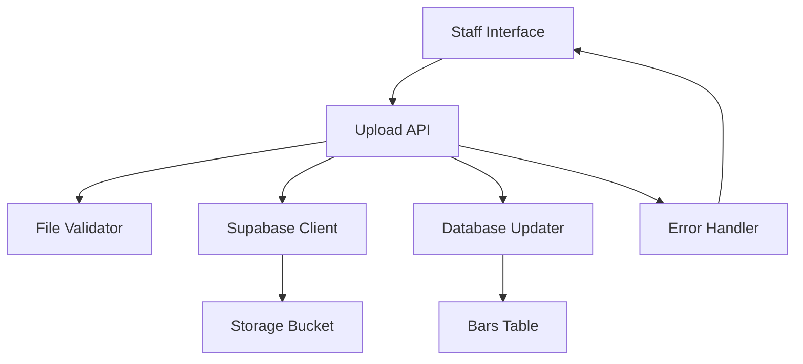

# Design Document

## Overview

This design addresses the critical 500 Internal Server Error occurring in the staff menu image upload functionality. The system currently fails when staff members attempt to upload PDF or image files through the `/api/upload-menu` endpoint. The design provides a comprehensive solution including infrastructure setup, error handling, and user experience improvements.

## Architecture

The image upload system follows a client-server architecture with the following components:



### Component Responsibilities

- **Staff Interface**: File selection, preview, progress indication, error display
- **Upload API**: Request handling, orchestration, response formatting
- **File Validator**: Type checking, size validation, security scanning
- **Supabase Client**: Storage operations, authentication, error handling
- **Storage Bucket**: File persistence, public URL generation
- **Database Updater**: Menu metadata persistence
- **Error Handler**: Diagnostic information, user-friendly messages

## Components and Interfaces

### Upload API Endpoint (`/api/upload-menu`)

**Input Interface:**
```typescript
interface UploadRequest {
  file: File;           // PDF, JPEG, PNG, or WebP
  barId: string;        // Bar identifier
}
```

**Output Interface:**
```typescript
interface UploadResponse {
  success: boolean;
  message: string;
  path?: string;        // Storage path
  url?: string;         // Public URL
  fileType?: 'pdf' | 'image';
  mimeType?: string;
  barId?: string;
  error?: string;       // Error message if failed
  details?: string;     // Detailed error information
}
```

### File Validator Component

**Validation Rules:**
- Supported formats: PDF, JPEG, PNG, WebP
- Maximum size: 10MB
- Minimum size: 1KB (prevent empty files)
- File header validation (prevent malicious uploads)

**Interface:**
```typescript
interface FileValidationResult {
  isValid: boolean;
  error?: string;
  fileType: 'pdf' | 'image';
  mimeType: string;
}
```

### Storage Infrastructure

**Bucket Configuration:**
- Name: `menu-files`
- Public read access: Enabled
- RLS policies: Configured for authenticated uploads
- File organization: `menus/{barId}/menu_{barId}_{timestamp}.{extension}`

**Required Environment Variables:**
- `NEXT_PUBLIC_SUPABASE_URL`: Supabase project URL
- `SUPABASE_SECRET_KEY`: Service role key for server operations

## Data Models

### Database Schema Updates

**Bars Table Fields:**
```sql
-- Existing fields used by upload system
static_menu_url: TEXT,           -- Storage path to uploaded file
static_menu_type: TEXT,          -- 'pdf', 'image', or 'slideshow'
menu_type: TEXT                  -- 'static' or 'interactive'
```

### File Storage Schema

**Storage Path Pattern:**
```
menus/{barId}/menu_{barId}_{timestamp}.{extension}
```

**Example:**
```
menus/123e4567-e89b-12d3-a456-426614174000/menu_123e4567-e89b-12d3-a456-426614174000_1704067200000.pdf
```

## Correctness Properties

*A property is a characteristic or behavior that should hold true across all valid executions of a system-essentially, a formal statement about what the system should do. Properties serve as the bridge between human-readable specifications and machine-verifiable correctness guarantees.*

### Property Analysis

<function_calls>
<invoke name="prework">
<parameter name="featureName">image-upload-fix

## Correctness Properties

*A property is a characteristic or behavior that should hold true across all valid executions of a system-essentially, a formal statement about what the system should do. Properties serve as the bridge between human-readable specifications and machine-verifiable correctness guarantees.*

### Property Reflection

After analyzing the acceptance criteria, several properties can be consolidated:
- Properties 1.1 and 4.1 both test valid file format acceptance - can be combined
- Properties 1.2, 4.3, and 4.4 all test the core upload flow - can be combined into a comprehensive upload property
- Properties 3.1, 3.2, 3.3 test different error scenarios - can be combined into error handling properties

### Core Properties

**Property 1: Valid file format acceptance**
*For any* file with a valid format (PDF, JPEG, PNG, WebP) and size under 10MB, the Upload_API should accept it for processing
**Validates: Requirements 1.1, 4.1**

**Property 2: Complete upload workflow**
*For any* valid file, uploading should result in storage persistence, database update, and public URL generation
**Validates: Requirements 1.2, 4.3, 4.4**

**Property 3: File size validation**
*For any* file exceeding 10MB, the File_Validator should reject it with a clear error message
**Validates: Requirements 1.4**

**Property 4: Invalid file type rejection**
*For any* file with an unsupported format, the File_Validator should reject it with a clear error message
**Validates: Requirements 1.5**

**Property 5: Public accessibility**
*For any* successfully uploaded file, the generated public URL should be accessible without authentication
**Validates: Requirements 2.2**

**Property 6: Authenticated upload capability**
*For any* authenticated request with valid credentials, the Upload_API should allow file uploads
**Validates: Requirements 2.3**

**Property 7: Environment variable error handling**
*For any* missing required environment variable, the Upload_API should return a specific error identifying the missing variable
**Validates: Requirements 3.1**

**Property 8: Unique file path generation**
*For any* two upload operations, the generated file paths should be unique to prevent conflicts
**Validates: Requirements 4.2**

**Property 9: Error detail provision**
*For any* failed operation, the Error_Handler should provide specific diagnostic information
**Validates: Requirements 3.5, 4.5**

**Property 10: UI state management**
*For any* upload operation, the Staff_Interface should correctly transition between loading, success, and error states
**Validates: Requirements 1.3, 5.1, 5.2, 5.3**

## Error Handling

### Error Classification System

**Infrastructure Errors:**
- Missing storage bucket → Provide bucket creation instructions
- Invalid environment variables → List specific missing variables
- Network connectivity issues → Distinguish client vs server problems

**Validation Errors:**
- Invalid file type → List supported formats
- File too large → Show size limit and current file size
- Empty file → Request valid file selection

**Storage Errors:**
- Permission denied → Provide RLS policy guidance
- Quota exceeded → Show storage usage information
- Upload timeout → Suggest retry with smaller file

### Error Response Format

```typescript
interface ErrorResponse {
  error: string;           // User-friendly message
  details?: string;        // Technical details
  code?: string;          // Error classification code
  suggestions?: string[]; // Actionable remediation steps
  timestamp: string;      // Error occurrence time
}
```

### Diagnostic Logging

**Log Levels:**
- INFO: Successful operations, file metadata
- WARN: Validation failures, retry attempts
- ERROR: Infrastructure failures, unexpected errors

**Log Format:**
```
[TIMESTAMP] [LEVEL] [COMPONENT] Message | Context: {key: value}
```

## Testing Strategy

### Dual Testing Approach

The system requires both unit tests and property-based tests for comprehensive coverage:

**Unit Tests:**
- Test specific error scenarios (missing bucket, invalid credentials)
- Test UI state transitions for known inputs
- Test database update operations
- Test file validation edge cases

**Property-Based Tests:**
- Test upload workflow across all valid file types and sizes
- Test error handling across various failure modes
- Test file path uniqueness across multiple uploads
- Test public URL accessibility for all uploaded files

### Property-Based Testing Configuration

- **Framework**: Use fast-check for TypeScript property-based testing
- **Iterations**: Minimum 100 iterations per property test
- **Test Data Generation**: 
  - Generate files of various valid formats and sizes
  - Generate invalid files with random extensions and content
  - Generate various error conditions (missing env vars, network failures)

### Test Tagging Format

Each property test must reference its design document property:
```typescript
// Feature: image-upload-fix, Property 1: Valid file format acceptance
```

### Integration Testing

**End-to-End Scenarios:**
1. Complete upload flow from UI to storage
2. Error recovery and retry mechanisms
3. Database consistency after uploads
4. Public URL accessibility verification

**Mock Strategies:**
- Mock Supabase client for error simulation
- Mock file system for large file testing
- Mock network conditions for timeout testing