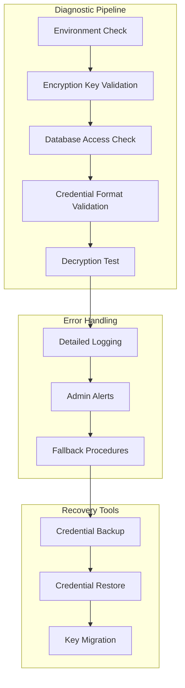

# Design Document: M-Pesa Integration Fix

## Overview

This design document outlines the systematic approach to diagnosing and fixing the M-Pesa credential decryption failure in production. The issue prevents the entire M-Pesa payment system from functioning, with the error "Failed to decrypt M-Pesa credentials" occurring when the system attempts to access stored credentials.

The fix involves comprehensive diagnosis of the encryption/decryption pipeline, environment variable validation, and implementation of robust error handling and recovery mechanisms.

## Problem Analysis

### Current State
- M-Pesa integration works perfectly in development environment
- Production deployment fails with credential decryption errors
- Error occurs at `/api/payments/mpesa/test` endpoint
- System uses AES-256-GCM encryption for credential storage
- Credentials are stored in Supabase database

### Root Cause Hypotheses
1. **Missing/Incorrect Encryption Key**: Production environment lacks the master encryption key
2. **Environment Variable Mismatch**: Required environment variables missing or incorrectly configured in Vercel
3. **Credential Format Issues**: Stored credentials corrupted or in unexpected format
4. **Database Access Issues**: Production app cannot access Supabase credential table
5. **Encryption Library Issues**: Different behavior between development and production environments

## Architecture

### Diagnostic Flow


## Components and Interfaces

### 1. Credential Diagnostic Service

**Responsibilities:**
- Systematically test each component of the credential system
- Provide detailed diagnostic information without exposing sensitive data
- Validate environment configuration and database access

**Key Methods:**
```typescript
interface CredentialDiagnosticService {
  runFullDiagnostic(): Promise<DiagnosticReport>
  validateEnvironmentVariables(): Promise<EnvironmentValidationResult>
  testEncryptionKey(): Promise<KeyValidationResult>
  validateDatabaseAccess(): Promise<DatabaseAccessResult>
  testCredentialDecryption(): Promise<DecryptionTestResult>
}
```

### 2. Environment Validator

**Responsibilities:**
- Check all required environment variables are present
- Validate environment variable formats and values
- Compare development vs production configurations

**Key Methods:**
```typescript
interface EnvironmentValidator {
  validateRequiredVariables(): Promise<ValidationResult>
  compareEnvironments(dev: EnvConfig, prod: EnvConfig): ComparisonResult
  generateEnvironmentChecklist(): EnvironmentChecklist
  validateEncryptionKeyFormat(key: string): boolean
}
```

### 3. Credential Recovery Service

**Responsibilities:**
- Backup and restore credential data
- Re-encrypt credentials with new keys
- Validate credential integrity

**Key Methods:**
```typescript
interface CredentialRecoveryService {
  backupCredentials(): Promise<CredentialBackup>
  restoreCredentials(backup: CredentialBackup): Promise<void>
  reEncryptCredentials(oldKey: string, newKey: string): Promise<void>
  validateCredentialIntegrity(): Promise<IntegrityReport>
}
```

## Data Models

### Diagnostic Report
```typescript
interface DiagnosticReport {
  timestamp: Date;
  environment: 'development' | 'production';
  environmentVariables: {
    present: string[];
    missing: string[];
    invalid: string[];
  };
  encryptionKey: {
    present: boolean;
    format: 'valid' | 'invalid' | 'missing';
    length: number;
  };
  databaseAccess: {
    connected: boolean;
    credentialTableExists: boolean;
    credentialCount: number;
  };
  credentialFormat: {
    valid: boolean;
    issues: string[];
  };
  decryptionTest: {
    successful: boolean;
    error?: string;
    errorType?: 'key' | 'format' | 'algorithm' | 'database';
  };
  recommendations: string[];
}
```

### Environment Configuration
```typescript
interface EnvironmentConfig {
  SUPABASE_URL: string;
  SUPABASE_ANON_KEY: string;
  SUPABASE_SERVICE_ROLE_KEY: string;
  ENCRYPTION_KEY: string;
  NODE_ENV: string;
  // Add other required variables
}
```

### Credential Validation Result
```typescript
interface CredentialValidationResult {
  exists: boolean;
  encrypted: boolean;
  format: 'valid' | 'corrupted' | 'unknown';
  encryptionMethod: string;
  lastModified: Date;
  canDecrypt: boolean;
  decryptionError?: string;
}
```

## Correctness Properties

### Property 1: Environment Variable Completeness
*For any* production deployment, all required environment variables should be present and properly formatted
**Validates: Requirements 2.1, 2.2, 2.3**

### Property 2: Encryption Key Consistency
*For any* environment with the same credentials, the encryption key should successfully decrypt the stored data
**Validates: Requirements 3.1, 3.2, 3.3**

### Property 3: Credential Format Integrity
*For any* stored credential, the encrypted format should be valid and decryptable with the correct key
**Validates: Requirements 4.1, 4.2, 4.3**

### Property 4: Diagnostic Accuracy
*For any* credential system failure, the diagnostic should correctly identify the root cause category
**Validates: Requirements 1.1, 1.2, 1.3**

### Property 5: Error Message Clarity
*For any* credential operation failure, error messages should be actionable without exposing sensitive data
**Validates: Requirements 6.1, 6.2, 6.3**

### Property 6: Recovery Process Completeness
*For any* credential backup and restore operation, no data should be lost and functionality should be preserved
**Validates: Requirements 7.1, 7.2, 7.3**

## Implementation Strategy

### Phase 1: Diagnostic Implementation
1. **Environment Variable Checker**: Validate all required variables are present in production
2. **Encryption Key Validator**: Test that the encryption key can encrypt/decrypt test data
3. **Database Access Tester**: Verify connection to Supabase and credential table access
4. **Credential Format Validator**: Check that stored credentials are in expected encrypted format

### Phase 2: Error Handling Enhancement
1. **Detailed Logging**: Add comprehensive logging without exposing sensitive data
2. **Error Categorization**: Classify errors by type (key, format, database, etc.)
3. **Admin Alerts**: Implement immediate notification for credential failures
4. **Fallback Procedures**: Create safe fallback when credentials are unavailable

### Phase 3: Recovery Tools
1. **Credential Backup**: Secure backup of encrypted credentials
2. **Key Migration**: Tools to re-encrypt credentials with new keys
3. **Integrity Validation**: Verify credential data hasn't been corrupted
4. **Deployment Validation**: Test credential system before going live

### Phase 4: Production Deployment
1. **Environment Setup**: Step-by-step production environment configuration
2. **Credential Migration**: Safe transfer of credentials to production
3. **Validation Testing**: Comprehensive testing without affecting live payments
4. **Monitoring Setup**: Real-time monitoring of credential system health

## Testing Strategy

### Diagnostic Testing
- Test diagnostic tools with various failure scenarios
- Validate error detection accuracy
- Ensure no sensitive data exposure in logs

### Environment Testing
- Test with missing environment variables
- Test with incorrect encryption keys
- Test with corrupted credential data

### Recovery Testing
- Test backup and restore procedures
- Test key migration with real encrypted data
- Test integrity validation with various corruption scenarios

### Production Readiness Testing
- Test complete deployment workflow
- Validate production environment setup
- Test monitoring and alerting systems

This comprehensive approach ensures that the M-Pesa credential decryption issue is systematically diagnosed and fixed, with robust error handling and recovery mechanisms to prevent future occurrences.