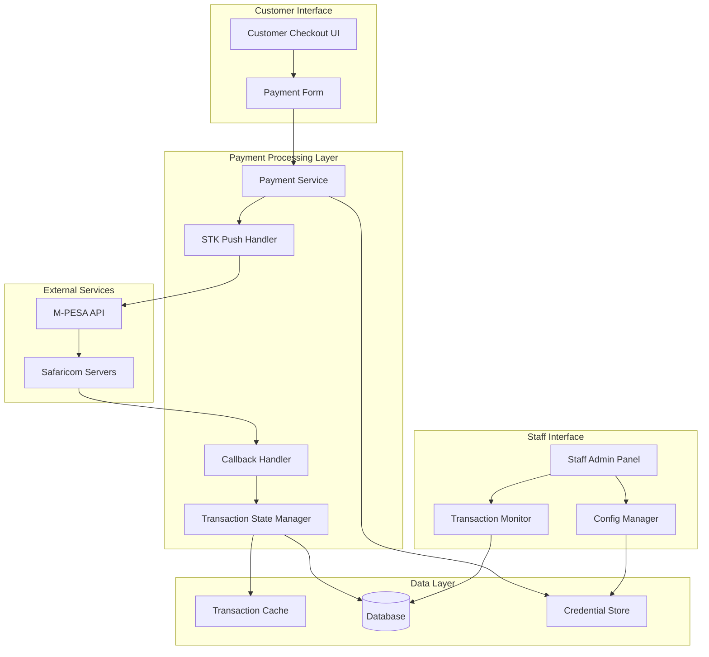
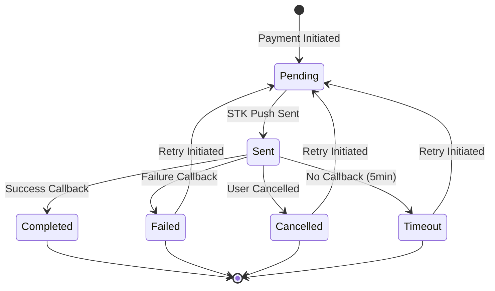

# Design Document: M-PESA Payment Integration

## Overview

This design document outlines the complete M-PESA payment integration system that enables customers to pay for orders using Safaricom's M-PESA Express (STK Push) API. The system builds upon existing credential management infrastructure and implements end-to-end payment processing with proper callback handling, transaction state management, and comprehensive error handling.

The integration supports both sandbox and production environments, provides real-time payment status updates, and includes administrative tools for monitoring and managing M-PESA transactions.

## Architecture

The M-PESA payment integration follows a microservices-oriented architecture with clear separation of concerns:



### Key Architectural Principles

1. **Asynchronous Processing**: Payment initiation and callback handling are decoupled
2. **State Management**: Clear transaction states with proper transitions
3. **Security First**: All sensitive data encrypted, callbacks validated
4. **Environment Isolation**: Clear separation between sandbox and production
5. **Monitoring & Observability**: Comprehensive logging and transaction tracking

## Components and Interfaces

### 1. Payment Service (`PaymentService`)

**Responsibilities:**
- Orchestrate payment initiation flow
- Validate customer input and order data
- Generate M-PESA request parameters
- Manage transaction lifecycle

**Key Methods:**
```typescript
interface PaymentService {
  initiatePayment(orderId: string, phoneNumber: string, amount: number): Promise<PaymentInitiationResult>
  getPaymentStatus(transactionId: string): Promise<PaymentStatus>
  retryPayment(transactionId: string): Promise<PaymentInitiationResult>
  cancelPayment(transactionId: string): Promise<void>
}
```

### 2. STK Push Handler (`STKPushHandler`)

**Responsibilities:**
- Generate M-PESA API authentication tokens
- Create properly formatted STK Push requests
- Handle M-PESA API communication
- Manage environment-specific configurations

**Key Methods:**
```typescript
interface STKPushHandler {
  generateAccessToken(): Promise<string>
  generatePassword(shortcode: string, passkey: string, timestamp: string): string
  sendSTKPush(request: STKPushRequest): Promise<STKPushResponse>
  validateCredentials(): Promise<boolean>
}
```

**Password Generation Algorithm:**
```typescript
generatePassword(shortcode: string, passkey: string, timestamp: string): string {
  const concatenated = shortcode + passkey + timestamp;
  return Buffer.from(concatenated).toString('base64');
}
```

### 3. Callback Handler (`CallbackHandler`)

**Responsibilities:**
- Receive and validate M-PESA callbacks
- Process successful and failed payment notifications
- Update transaction states
- Trigger order status updates

**Key Methods:**
```typescript
interface CallbackHandler {
  handleSTKCallback(callbackData: STKCallbackData): Promise<void>
  validateCallback(callbackData: any): boolean
  processSuccessfulPayment(transactionData: SuccessfulPaymentData): Promise<void>
  processFailedPayment(transactionData: FailedPaymentData): Promise<void>
}
```

### 4. Transaction State Manager (`TransactionStateManager`)

**Responsibilities:**
- Maintain transaction state consistency
- Handle state transitions
- Provide transaction history and status queries
- Implement timeout handling

**State Diagram:**


### 5. Credential Store Integration

**Existing Infrastructure:**
- AES-256-GCM encryption with master key
- Secure database storage in `mpesa_credentials` table
- Environment-specific credential management

**Enhanced Interface:**
```typescript
interface CredentialStore {
  getCredentials(environment: 'sandbox' | 'production'): Promise<MpesaCredentials>
  saveCredentials(credentials: MpesaCredentials, environment: string): Promise<void>
  validateCredentials(credentials: MpesaCredentials): Promise<boolean>
  rotateCredentials(environment: string): Promise<void>
}
```

## Data Models

### Transaction Model
```typescript
interface Transaction {
  id: string;
  orderId: string;
  customerId: string;
  phoneNumber: string;
  amount: number;
  currency: 'KES';
  status: TransactionStatus;
  checkoutRequestId?: string;
  mpesaReceiptNumber?: string;
  transactionDate?: Date;
  failureReason?: string;
  resultCode?: number;
  environment: 'sandbox' | 'production';
  createdAt: Date;
  updatedAt: Date;
  callbackData?: any;
}

type TransactionStatus = 
  | 'pending' 
  | 'sent' 
  | 'completed' 
  | 'failed' 
  | 'cancelled' 
  | 'timeout';
```

### STK Push Request Model
```typescript
interface STKPushRequest {
  BusinessShortCode: string;
  Password: string;
  Timestamp: string;
  TransactionType: 'CustomerPayBillOnline' | 'CustomerBuyGoodsOnline';
  Amount: number;
  PartyA: string; // Customer phone number
  PartyB: string; // Organization shortcode
  PhoneNumber: string;
  CallBackURL: string;
  AccountReference: string; // Max 12 chars
  TransactionDesc: string; // Max 13 chars
}
```

### Callback Data Models
```typescript
interface STKCallbackData {
  Body: {
    stkCallback: {
      MerchantRequestID: string;
      CheckoutRequestID: string;
      ResultCode: number;
      ResultDesc: string;
      CallbackMetadata?: {
        Item: Array<{
          Name: string;
          Value: string | number;
        }>;
      };
    };
  };
}

interface SuccessfulPaymentData {
  mpesaReceiptNumber: string;
  transactionDate: string;
  amount: number;
  phoneNumber: string;
}
```

### M-PESA Credentials Model (Enhanced)
```typescript
interface MpesaCredentials {
  consumerKey: string;
  consumerSecret: string;
  businessShortCode: string;
  passkey: string;
  environment: 'sandbox' | 'production';
  callbackUrl: string;
  timeoutUrl?: string;
  encryptedAt: Date;
  lastValidated?: Date;
}
```

## Correctness Properties

*A property is a characteristic or behavior that should hold true across all valid executions of a system-essentially, a formal statement about what the system should do. Properties serve as the bridge between human-readable specifications and machine-verifiable correctness guarantees.*

Based on the prework analysis, here are the key correctness properties for the M-PESA payment integration:

### Property 1: STK Push Request Completeness
*For any* valid payment request with customer phone number and order details, the generated STK Push request should contain all required parameters: BusinessShortCode, Password, Timestamp, TransactionType, Amount, PartyA, PartyB, PhoneNumber, CallBackURL, AccountReference, and TransactionDesc
**Validates: Requirements 1.1, 1.3**

### Property 2: Password Generation Correctness
*For any* valid shortcode, passkey, and timestamp combination, the generated password should equal base64(shortcode+passkey+timestamp)
**Validates: Requirements 1.2**

### Property 3: Transaction Persistence and Association
*For any* initiated STK Push request, a transaction record should be created and properly associated with the customer order
**Validates: Requirements 1.4**

### Property 4: Environment Configuration Consistency
*For any* environment setting (sandbox or production), the system should use the corresponding URLs, credentials, and validation rules consistently throughout the payment flow
**Validates: Requirements 1.5, 1.6, 8.1, 8.2, 8.3**

### Property 5: Callback Data Extraction Completeness
*For any* valid M-PESA callback (successful or failed), all relevant data fields should be correctly extracted and processed according to the callback type
**Validates: Requirements 2.1, 2.2, 2.3**

### Property 6: Transaction State Transitions
*For any* transaction, state transitions should follow the defined flow: pending → sent → (completed|failed|cancelled|timeout), with proper data updates at each transition
**Validates: Requirements 6.1, 6.2, 6.3, 6.4, 6.5, 6.6**

### Property 7: Order Status Synchronization
*For any* payment callback received, the corresponding order status should be updated to match the payment result (paid for success, payment_failed for failure)
**Validates: Requirements 2.4, 2.5**

### Property 8: Audit Trail Completeness
*For any* transaction or callback processed, complete audit information should be logged with proper encryption of sensitive data
**Validates: Requirements 2.6, 5.1**

### Property 9: Phone Number Validation
*For any* phone number input, the validation should correctly identify valid 254XXXXXXXX format numbers and reject invalid formats
**Validates: Requirements 3.3**

### Property 10: Input Sanitization Security
*For any* customer input (phone numbers, amounts), the system should properly sanitize and validate to prevent injection attacks
**Validates: Requirements 5.3**

### Property 11: Callback Authentication
*For any* received callback, the system should validate authenticity and reject fraudulent notifications
**Validates: Requirements 5.2**

### Property 12: Rate Limiting Enforcement
*For any* sequence of payment requests from the same source, rate limiting should be enforced to prevent abuse
**Validates: Requirements 5.4**

### Property 13: Credential Security Round Trip
*For any* M-PESA credentials, the encryption-decryption cycle should preserve the original data while maintaining security
**Validates: Requirements 5.6, 4.2**

### Property 14: Error Handling and Logging
*For any* error condition, detailed information should be logged for debugging while user-facing messages should not expose sensitive data
**Validates: Requirements 5.5, 7.1, 7.2**

### Property 15: Duplicate Transaction Prevention
*For any* duplicate payment attempt, the system should prevent duplicate charges and return the original transaction status
**Validates: Requirements 7.4**

### Property 16: Network Resilience
*For any* network error during callback processing, the system should implement proper retry logic with exponential backoff
**Validates: Requirements 7.5, 7.6**

### Property 17: Configuration Validation
*For any* environment configuration, invalid settings should prevent payment processing and display appropriate error messages
**Validates: Requirements 8.4, 8.5**

### Property 18: Sandbox Testing Constraints
*For any* sandbox environment operation, only approved test phone numbers and amounts should be used as per Safaricom documentation
**Validates: Requirements 8.6**

<function_calls>
<invoke name="prework">
<parameter name="featureName">mpesa-payment-integration

## Error Handling

### Error Categories and Responses

#### 1. M-PESA API Errors
- **Connection Failures**: Retry with exponential backoff, fallback to maintenance mode
- **Authentication Errors**: Log securely, display generic "payment unavailable" message
- **Invalid Request Errors**: Log request details, return specific validation errors to staff interface
- **Rate Limiting**: Implement client-side rate limiting, queue requests during high traffic

#### 2. Callback Processing Errors
- **Invalid Callback Format**: Log and discard, alert administrators
- **Authentication Failures**: Log security event, reject callback
- **Processing Failures**: Queue for retry with exponential backoff
- **Duplicate Callbacks**: Idempotent processing, log duplicate attempts

#### 3. Customer Input Errors
- **Invalid Phone Numbers**: Real-time validation with helpful formatting guidance
- **Insufficient Funds**: Display M-PESA error message, offer alternative payment methods
- **User Cancellation**: Handle gracefully, offer retry or alternative options
- **Timeout Scenarios**: Clear messaging, automatic retry options

#### 4. System Errors
- **Database Failures**: Graceful degradation, transaction queuing
- **Encryption Errors**: Fail securely, alert administrators immediately
- **Configuration Errors**: Prevent payment processing, display admin-only error details

### Error Recovery Strategies

#### Automatic Recovery
- **Network Timeouts**: 3 retries with exponential backoff (1s, 2s, 4s)
- **Callback Processing**: Queue failed callbacks for retry (max 5 attempts)
- **Transaction Timeouts**: Automatic status update after 5 minutes

#### Manual Recovery
- **Staff Interface**: Tools for manual transaction reconciliation
- **Admin Alerts**: Immediate notification for critical errors
- **Audit Tools**: Complete transaction history for debugging

## Testing Strategy

### Dual Testing Approach

The M-PESA payment integration requires both unit testing and property-based testing to ensure comprehensive coverage:

#### Unit Testing Focus
- **Specific Examples**: Test known good/bad inputs and expected outputs
- **Edge Cases**: Boundary conditions, empty inputs, malformed data
- **Integration Points**: API communication, database operations, callback handling
- **Error Conditions**: Specific error scenarios and recovery paths

#### Property-Based Testing Focus
- **Universal Properties**: Test properties that should hold for all valid inputs
- **Randomized Input Coverage**: Generate thousands of test cases automatically
- **Correctness Validation**: Verify each design property with minimum 100 iterations
- **Regression Prevention**: Catch edge cases that manual testing might miss

### Property-Based Testing Configuration

**Testing Framework**: Use `fast-check` for TypeScript/Node.js property-based testing
**Test Configuration**:
- Minimum 100 iterations per property test
- Custom generators for M-PESA specific data (phone numbers, amounts, timestamps)
- Shrinking enabled to find minimal failing examples
- Timeout configuration for async operations

**Property Test Tagging**:
Each property-based test must include a comment referencing its design document property:
```typescript
// Feature: mpesa-payment-integration, Property 1: STK Push Request Completeness
```

### Test Environment Setup

#### Sandbox Testing
- **Safaricom Test Credentials**: Use official sandbox credentials
- **Test Phone Numbers**: Only use approved test numbers (254708374149, 254711XXXXXX)
- **Test Amounts**: Use small amounts (1-1000 KES) for testing
- **Mock Callbacks**: Simulate various callback scenarios

#### Production Testing
- **Smoke Tests**: Basic connectivity and credential validation
- **Monitoring**: Real-time transaction success rate monitoring
- **Rollback Plan**: Immediate rollback capability for production issues

### Testing Checklist

#### Pre-Deployment Testing
- [ ] All unit tests passing
- [ ] All property-based tests passing (minimum 100 iterations each)
- [ ] Sandbox integration tests successful
- [ ] Error handling scenarios tested
- [ ] Performance testing completed
- [ ] Security testing completed

#### Production Readiness
- [ ] Production credentials validated
- [ ] Callback URLs accessible and secure
- [ ] Monitoring and alerting configured
- [ ] Rollback procedures tested
- [ ] Staff training completed
- [ ] Documentation updated

### Continuous Testing

#### Automated Testing Pipeline
- **Pre-commit**: Unit tests and basic property tests
- **CI/CD**: Full test suite including extended property testing
- **Staging**: Integration tests with sandbox environment
- **Production**: Continuous monitoring and health checks

#### Monitoring and Alerting
- **Transaction Success Rate**: Alert if below 95%
- **API Response Times**: Alert if above 5 seconds
- **Error Rate Monitoring**: Alert on unusual error patterns
- **Callback Processing**: Alert on callback processing failures

This comprehensive testing strategy ensures that the M-PESA integration is robust, reliable, and ready for production use while maintaining high code quality and system reliability.