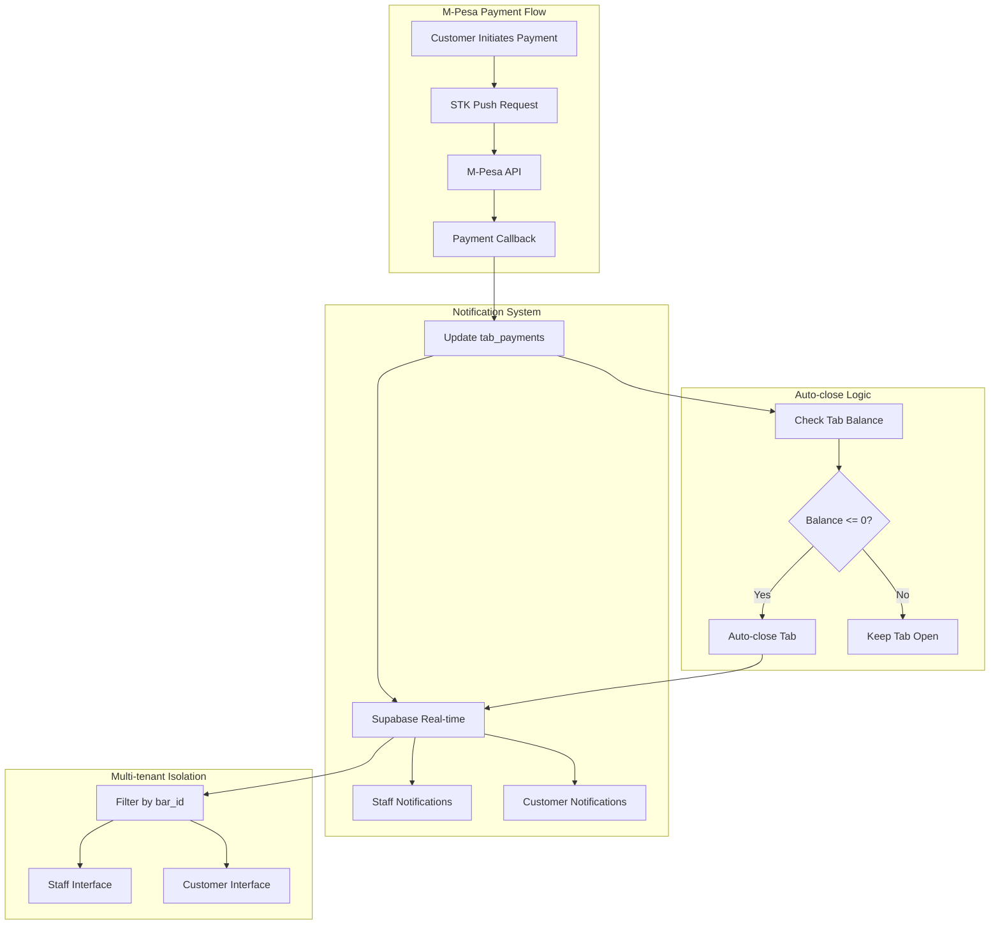

# Design Document: M-Pesa Payment Notifications

## Overview

This design implements real-time notifications for M-Pesa payments to ensure they behave identically to cash payments in the Tabeza system. The current M-Pesa implementation correctly processes payments through the `tab_payments` table but lacks the real-time notification infrastructure that provides immediate feedback to both staff and customers.

The solution leverages the existing Supabase real-time subscription system used for orders and messages, extending it to include payment events. This ensures consistent user experience across all payment methods while maintaining the multi-tenant architecture and security requirements.

## Architecture

### High-Level Architecture



### Component Interaction

The notification system integrates with existing components:

1. **M-Pesa Callback Handler** (`apps/customer/app/api/mpesa/callback/route.ts`)
   - Processes payment confirmations from Safaricom
   - Updates `tab_payments` table with payment status
   - Triggers auto-close logic for overdue tabs

2. **Real-time Subscription Hook** (`packages/shared/hooks/useRealtimeSubscription.ts`)
   - Existing hook that manages Supabase real-time connections
   - Already used for orders and messages
   - Will be extended to handle payment notifications

3. **Staff Interface** (`apps/staff/`)
   - Currently subscribes to `tab_payments` table but lacks notification UI
   - Will display payment notifications similar to order notifications

4. **Customer Interface** (`apps/customer/`)
   - Currently lacks payment status subscriptions
   - Will receive payment confirmations and tab status updates

## Components and Interfaces

### Enhanced M-Pesa Callback Handler

The existing callback handler will be enhanced to trigger notifications:

```typescript
interface PaymentNotificationTrigger {
  paymentId: string;
  tabId: string;
  barId: string;
  amount: number;
  status: 'success' | 'failed';
  method: 'mpesa';
  timestamp: string;
  mpesaReceiptNumber?: string;
}
```

### Real-time Subscription Configuration

Extension of existing subscription patterns:

```typescript
interface PaymentSubscriptionConfig {
  channelName: string; // Format: `payments-{barId}` or `tab-payments-{tabId}`
  table: 'tab_payments';
  filter: string; // Bar-level or tab-level filtering
  event: 'INSERT' | 'UPDATE' | '*';
  handler: (payload: PaymentNotificationPayload) => void;
}

interface PaymentNotificationPayload {
  eventType: 'INSERT' | 'UPDATE';
  new: TabPayment;
  old?: TabPayment;
  schema: string;
  table: string;
}
```

### Notification UI Components

New components for consistent payment notifications:

```typescript
interface PaymentNotificationProps {
  payment: TabPayment;
  tab: Tab;
  type: 'success' | 'failed' | 'processing';
  onDismiss?: () => void;
}

interface PaymentToastConfig {
  type: 'success' | 'error' | 'info';
  title: string;
  message: string;
  duration?: number;
  actions?: ToastAction[];
}
```

## Data Models

### Enhanced Tab Payment Model

The existing `tab_payments` table structure supports the notification system:

```typescript
interface TabPayment {
  id: string;
  tab_id: string;
  amount: number;
  method: 'mpesa' | 'cash' | 'card';
  status: 'pending' | 'success' | 'failed';
  reference: string; // M-Pesa CheckoutRequestID
  metadata: MpesaCallbackData | null;
  created_at: string;
  updated_at: string;
}
```

### Notification Event Model

```typescript
interface PaymentNotificationEvent {
  id: string;
  payment: TabPayment;
  tab: Tab;
  bar: Bar;
  eventType: 'payment_received' | 'payment_failed' | 'tab_auto_closed';
  timestamp: string;
  recipients: NotificationRecipient[];
}

interface NotificationRecipient {
  type: 'staff' | 'customer';
  barId?: string;
  tabId?: string;
  deviceId?: string;
}
```

### Auto-close Event Model

```typescript
interface TabAutoCloseEvent {
  tabId: string;
  barId: string;
  paymentId: string;
  previousStatus: 'overdue';
  newStatus: 'closed';
  finalBalance: number;
  closedBy: 'system';
  timestamp: string;
}
```

## Correctness Properties

*A property is a characteristic or behavior that should hold true across all valid executions of a system—essentially, a formal statement about what the system should do. Properties serve as the bridge between human-readable specifications and machine-verifiable correctness guarantees.*

Before writing the correctness properties, I need to analyze the acceptance criteria from the requirements document to determine which ones are testable as properties.

### Property 1: Real-time Notification Delivery
*For any* successful M-Pesa payment, all connected staff and customer interfaces for the relevant bar should receive notifications within 2 seconds of payment processing
**Validates: Requirements 1.1, 2.1**

### Property 2: Multi-tenant Notification Isolation
*For any* M-Pesa payment notification, only staff members with access to the payment's bar should receive the notification, and all tenant isolation rules should be enforced
**Validates: Requirements 3.1, 3.2, 3.3**

### Property 3: Payment Method UI Consistency
*For any* payment notification (M-Pesa, cash, or card), the UI components, information fields, audio alerts, and visual styling should be identical across all payment methods
**Validates: Requirements 1.2, 7.1, 7.2, 7.3, 7.4, 7.5**

### Property 4: Real-time Balance Updates
*For any* M-Pesa payment, all connected clients should immediately see updated tab balances that accurately reflect the payment amount and remaining balance
**Validates: Requirements 4.1, 4.3, 4.5**

### Property 5: Auto-close Notification Completeness
*For any* overdue tab that is paid in full via M-Pesa, both staff and customers should receive complete auto-close notifications containing tab number, final amount, closure timestamp, and clear identification of which tab was closed
**Validates: Requirements 5.1, 5.2, 5.3, 5.4, 5.5**

### Property 6: Callback Processing Consistency
*For any* M-Pesa callback, the payment processing should use the service role client, trigger identical notifications as manual payments, handle duplicates idempotently, and validate all input data
**Validates: Requirements 6.1, 6.2, 6.4, 6.5**

### Property 7: Broadcast Notification Delivery
*For any* bar with multiple connected staff members, payment notifications should be delivered simultaneously to all connected clients
**Validates: Requirements 1.3, 1.4**

### Property 8: Customer Payment Confirmation Completeness
*For any* M-Pesa payment (successful or failed), customers should receive complete confirmation messages containing payment status, updated balance, transaction reference, and appropriate action options
**Validates: Requirements 2.2, 2.3, 2.4**

### Property 9: Tab Balance Auto-close Triggering
*For any* tab balance that reaches zero or negative through M-Pesa payment, the system should automatically trigger tab closure notifications if the tab was previously overdue
**Validates: Requirements 4.2**

### Property 10: Audit Trail Completeness
*For any* M-Pesa payment notification, audit logs should contain correct bar_id, staff_id, and traceability information
**Validates: Requirements 3.5**

### Property 11: Business Hours Independence
*For any* M-Pesa payment received outside business hours, notifications should still be delivered to connected staff members
**Validates: Requirements 1.5**

### Property 12: Environment Configuration Correctness
*For any* environment (sandbox or production), the payment notification system should use the correct Supabase configuration and handle missing environment variables gracefully
**Validates: Requirements 8.1, 8.2, 8.3**

## Error Handling

### Callback Processing Errors

The M-Pesa callback handler implements comprehensive error handling:

1. **Malformed JSON**: Returns HTTP 400 with error details
2. **Missing Required Fields**: Validates CheckoutRequestID and ResultCode presence
3. **Payment Not Found**: Logs error but returns success to prevent M-Pesa retries
4. **Database Update Failures**: Returns HTTP 500 with error logging
5. **Auto-close Logic Errors**: Logs errors but doesn't fail the callback processing

### Real-time Subscription Errors

The notification system handles subscription failures:

1. **Connection Failures**: Automatic retry with exponential backoff
2. **Authentication Errors**: Re-establish connection with fresh credentials
3. **Network Timeouts**: Graceful degradation with offline indicators
4. **Subscription Limit Exceeded**: Queue notifications for later delivery

### Multi-tenant Security Errors

Tenant isolation failures are handled securely:

1. **Unauthorized Access**: Reject notifications without logging sensitive data
2. **Cross-tenant Data Leaks**: Apply row-level security at database level
3. **Invalid Bar Access**: Validate staff permissions before notification delivery
4. **Malicious Callbacks**: Validate bar_id matches payment before processing

### UI Error States

Both staff and customer interfaces handle notification errors:

1. **Failed Notifications**: Show retry options with exponential backoff
2. **Stale Data**: Display data freshness indicators and refresh options
3. **Connection Loss**: Show offline indicators and queue notifications
4. **Partial Updates**: Ensure atomic updates or clear error states

## Testing Strategy

### Dual Testing Approach

The testing strategy combines unit tests for specific scenarios with property-based tests for comprehensive coverage:

**Unit Tests Focus:**
- Specific callback payload formats and edge cases
- Error conditions and malformed data handling
- Environment configuration validation
- UI component rendering with specific payment data
- Database trigger behavior for auto-close logic

**Property-Based Tests Focus:**
- Universal notification delivery across all payment amounts and bar configurations
- Multi-tenant isolation across randomly generated bar and staff combinations
- UI consistency across all payment method combinations
- Real-time subscription behavior across various connection states
- Callback processing idempotency across duplicate and malformed requests

### Property-Based Testing Configuration

Each property test will be implemented using fast-check with minimum 100 iterations:

- **Test Library**: fast-check for TypeScript property-based testing
- **Minimum Iterations**: 100 per property test to ensure comprehensive coverage
- **Tag Format**: **Feature: mpesa-payment-notifications, Property {number}: {property_text}**
- **Environment**: Tests run against both sandbox and production configurations
- **Data Generation**: Random payment amounts, bar configurations, staff permissions, and callback payloads

### Integration Testing

Integration tests validate end-to-end notification flows:

1. **M-Pesa Callback to Notification**: Full flow from callback receipt to UI notification
2. **Multi-tenant Isolation**: Cross-bar notification filtering and security
3. **Auto-close Integration**: Payment processing triggering tab closure and notifications
4. **Real-time Subscription Lifecycle**: Connection establishment, notification delivery, and cleanup
5. **Environment Switching**: Configuration changes between sandbox and production

### Performance Testing

Performance tests ensure notification delivery meets timing requirements:

1. **2-Second Delivery Guarantee**: Measure notification delivery time under various loads
2. **Concurrent Staff Notifications**: Test broadcast delivery to multiple connected clients
3. **Database Update Performance**: Ensure callback processing completes within acceptable time
4. **Memory Usage**: Monitor real-time subscription memory consumption
5. **Connection Scaling**: Test notification system with increasing numbers of connected clients

The testing strategy ensures that M-Pesa payment notifications provide the same reliable, fast, and consistent experience as existing cash payment notifications while maintaining the security and multi-tenant isolation requirements of the Tabeza platform.