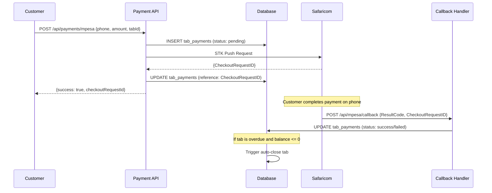
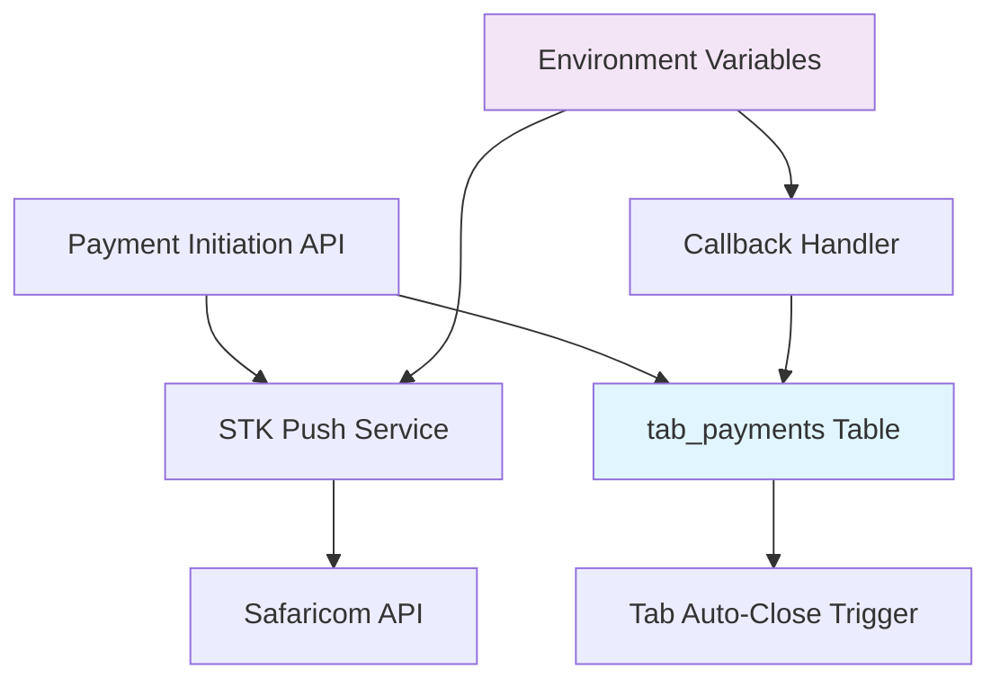

# Design Document: M-Pesa Payment Simplification

## Overview

This design transforms the over-engineered M-Pesa payment system into a simple, maintainable solution that mirrors the cash payment system's elegance. The current 2000+ line implementation with 4+ database tables will be replaced with a ~100 line solution using the existing `tab_payments` table.

### Design Principles

1. **Simplicity First**: Match the cash payment system's ~10 line complexity
2. **Single Source of Truth**: Use only the `tab_payments` table for all payment methods
3. **Environment-Based Config**: Store credentials in environment variables, not encrypted database tables
4. **Direct API Calls**: Eliminate service factories and complex abstractions
5. **Consistent Behavior**: M-Pesa payments should behave identically to cash payments after initiation

## Architecture

### High-Level Flow



### Component Architecture



## Components and Interfaces

### 1. Payment Initiation API

**Location**: `apps/customer/app/api/payments/mpesa/route.ts`

```typescript
interface MpesaPaymentRequest {
  tabId: string;
  phoneNumber: string;
  amount: number;
}

interface MpesaPaymentResponse {
  success: boolean;
  checkoutRequestId?: string;
  error?: string;
}
```

**Responsibilities**:
- Validate phone number format (254XXXXXXXXX)
- Validate amount (positive, reasonable limits)
- Create pending payment record in `tab_payments`
- Make STK Push API call to Safaricom
- Update payment record with checkout request ID
- Return response to client

### 2. STK Push Service

**Location**: `packages/shared/src/services/mpesa-simple.ts`

```typescript
interface STKPushRequest {
  phoneNumber: string;
  amount: number;
  accountReference: string;
  transactionDesc: string;
}

interface STKPushResponse {
  ResponseCode: string;
  ResponseDescription: string;
  MerchantRequestID: string;
  CheckoutRequestID: string;
}
```

**Responsibilities**:
- Generate OAuth access token
- Format STK Push request payload
- Make HTTP request to Safaricom API
- Handle API errors and timeouts
- Return structured response

### 3. Callback Handler

**Location**: `apps/customer/app/api/mpesa/callback/route.ts`

```typescript
interface MpesaCallback {
  Body: {
    stkCallback: {
      MerchantRequestID: string;
      CheckoutRequestID: string;
      ResultCode: number;
      ResultDesc: string;
      CallbackMetadata?: {
        Item: Array<{
          Name: string;
          Value: string | number;
        }>;
      };
    };
  };
}
```

**Responsibilities**:
- Receive and validate Safaricom callbacks
- Extract payment status from ResultCode
- Update `tab_payments` record status
- Store complete callback data in metadata
- Handle callback processing errors gracefully

### 4. Environment Configuration

**Required Environment Variables**:
```env
# M-Pesa Configuration
MPESA_ENVIRONMENT=sandbox|production
MPESA_CONSUMER_KEY=your_consumer_key
MPESA_CONSUMER_SECRET=your_consumer_secret
MPESA_BUSINESS_SHORTCODE=174379
MPESA_PASSKEY=your_passkey
MPESA_CALLBACK_URL=https://yourdomain.com/api/mpesa/callback

# Safaricom API URLs
MPESA_OAUTH_URL=https://sandbox.safaricom.co.ke/oauth/v1/generate?grant_type=client_credentials
MPESA_STK_PUSH_URL=https://sandbox.safaricom.co.ke/mpesa/stkpush/v1/processrequest
```

## Data Models

### Existing `tab_payments` Table

The system will use the existing `tab_payments` table without modifications:

```sql
CREATE TABLE tab_payments (
  id UUID PRIMARY KEY DEFAULT gen_random_uuid(),
  tab_id UUID NOT NULL REFERENCES tabs(id) ON DELETE CASCADE,
  amount NUMERIC(10,2) NOT NULL,
  method TEXT NOT NULL CHECK (method IN ('cash', 'mpesa', 'card')),
  status TEXT NOT NULL DEFAULT 'pending' CHECK (status IN ('pending', 'success', 'failed')),
  reference TEXT NULL, -- CheckoutRequestID for M-Pesa
  metadata JSONB NULL, -- Complete callback data
  created_at TIMESTAMPTZ DEFAULT NOW(),
  updated_at TIMESTAMPTZ DEFAULT NOW()
);
```

### M-Pesa Payment Record Lifecycle

1. **Initiation**: `{method: 'mpesa', status: 'pending', reference: null}`
2. **STK Push Sent**: `{reference: 'CheckoutRequestID'}`
3. **Callback Received**: `{status: 'success'|'failed', metadata: callbackData}`

## Implementation Details

### 1. Payment Initiation Flow

```typescript
export async function POST(request: Request) {
  const { tabId, phoneNumber, amount } = await request.json();
  
  // Validate inputs
  if (!isValidKenyanPhone(phoneNumber)) {
    return NextResponse.json({ error: 'Invalid phone number' }, { status: 400 });
  }
  
  // Create pending payment
  const { data: payment } = await supabase
    .from('tab_payments')
    .insert({
      tab_id: tabId,
      amount,
      method: 'mpesa',
      status: 'pending'
    })
    .select()
    .single();
  
  // Send STK Push
  const stkResponse = await sendSTKPush({
    phoneNumber,
    amount,
    accountReference: `TAB${tabId}`,
    transactionDesc: 'Tab Payment'
  });
  
  // Update with checkout request ID
  await supabase
    .from('tab_payments')
    .update({ reference: stkResponse.CheckoutRequestID })
    .eq('id', payment.id);
  
  return NextResponse.json({
    success: true,
    checkoutRequestId: stkResponse.CheckoutRequestID
  });
}
```

### 2. STK Push Implementation

```typescript
async function sendSTKPush(request: STKPushRequest): Promise<STKPushResponse> {
  // Get OAuth token
  const token = await getOAuthToken();
  
  // Generate password and timestamp
  const timestamp = new Date().toISOString().replace(/[^0-9]/g, '').slice(0, -3);
  const password = Buffer.from(
    `${process.env.MPESA_BUSINESS_SHORTCODE}${process.env.MPESA_PASSKEY}${timestamp}`
  ).toString('base64');
  
  // Make STK Push request
  const response = await fetch(process.env.MPESA_STK_PUSH_URL!, {
    method: 'POST',
    headers: {
      'Authorization': `Bearer ${token}`,
      'Content-Type': 'application/json'
    },
    body: JSON.stringify({
      BusinessShortCode: process.env.MPESA_BUSINESS_SHORTCODE,
      Password: password,
      Timestamp: timestamp,
      TransactionType: 'CustomerPayBillOnline',
      Amount: request.amount,
      PartyA: request.phoneNumber,
      PartyB: process.env.MPESA_BUSINESS_SHORTCODE,
      PhoneNumber: request.phoneNumber,
      CallBackURL: process.env.MPESA_CALLBACK_URL,
      AccountReference: request.accountReference,
      TransactionDesc: request.transactionDesc
    })
  });
  
  return response.json();
}
```

### 3. Callback Processing

```typescript
export async function POST(request: Request) {
  const callback: MpesaCallback = await request.json();
  const { CheckoutRequestID, ResultCode } = callback.Body.stkCallback;
  
  // Determine payment status
  const status = ResultCode === 0 ? 'success' : 'failed';
  
  // Update payment record
  await supabase
    .from('tab_payments')
    .update({
      status,
      metadata: callback,
      updated_at: new Date().toISOString()
    })
    .eq('reference', CheckoutRequestID);
  
  return NextResponse.json({ success: true });
}
```

### 4. Tab Auto-Close Logic

The existing database trigger will handle auto-closing overdue tabs:

```sql
-- Existing trigger function (no changes needed)
CREATE OR REPLACE FUNCTION auto_close_overdue_tab_on_payment()
RETURNS TRIGGER AS $$
BEGIN
  -- Only auto-close if tab is overdue and balance is zero or negative
  IF NEW.status = 'success' THEN
    UPDATE tabs 
    SET status = 'closed', 
        closed_at = NOW(),
        closed_by = 'system'
    WHERE id = NEW.tab_id 
      AND status = 'overdue'
      AND (
        SELECT COALESCE(SUM(CASE WHEN o.status = 'confirmed' THEN o.total ELSE 0 END), 0) -
               COALESCE(SUM(CASE WHEN p.status = 'success' THEN p.amount ELSE 0 END), 0)
        FROM tab_orders o
        LEFT JOIN tab_payments p ON p.tab_id = o.tab_id
        WHERE o.tab_id = NEW.tab_id
      ) <= 0;
  END IF;
  
  RETURN NEW;
END;
$$ LANGUAGE plpgsql;
```

## Correctness Properties

*A property is a characteristic or behavior that should hold true across all valid executions of a system-essentially, a formal statement about what the system should do. Properties serve as the bridge between human-readable specifications and machine-verifiable correctness guarantees.*

Now I need to analyze the acceptance criteria to create correctness properties. Let me use the prework tool:

<function_calls>
<invoke name="prework">
<parameter name="featureName">mpesa-payment-simplification

### Property 1: Payment Record Creation and Updates
*For any* valid M-Pesa payment initiation, the system should create a pending record in `tab_payments` with method 'mpesa', and when callbacks are received, should update the same record rather than creating new ones.
**Validates: Requirements 1.1, 1.2, 2.2**

### Property 2: Conditional Auto-Close Behavior  
*For any* successful M-Pesa payment on an overdue tab with zero or negative balance, the tab should be automatically closed by the system.
**Validates: Requirements 1.3, 3.4**

### Property 3: Payment Method Consistency
*For any* M-Pesa payment after initial creation, the system should handle it identically to cash payments in terms of balance calculations and tab management.
**Validates: Requirements 1.5**

### Property 4: STK Push Initiation
*For any* valid phone number and amount combination, the system should initiate an STK Push request to Safaricom with correct parameters.
**Validates: Requirements 2.1**

### Property 5: Input Validation
*For any* input to the payment system, phone numbers should be validated as Kenyan format (254XXXXXXXXX) and amounts should be positive and within reasonable limits.
**Validates: Requirements 2.4, 2.5**

### Property 6: Callback Processing
*For any* Safaricom callback received, the system should update the corresponding payment record with success status for ResultCode=0 and failed status for ResultCode≠0, while storing complete callback data in metadata.
**Validates: Requirements 3.1, 3.2, 3.3, 3.5**

### Property 7: Environment Configuration
*For any* system startup, M-Pesa credentials should be read from environment variables, support both sandbox and production modes, and validate all required configuration is present.
**Validates: Requirements 4.1, 4.2, 4.4, 4.5, 9.1, 9.2**

### Property 8: API Response Format
*For any* payment initiation request, successful requests should return checkout request IDs and failed requests should return specific error details.
**Validates: Requirements 5.3, 5.4**

### Property 9: Error Handling and Logging
*For any* error condition (API failures, invalid inputs, callback processing failures), the system should log appropriate details, return user-friendly messages, and continue functioning without crashes.
**Validates: Requirements 6.1, 6.2, 6.3, 6.4**

### Property 10: Performance and Resilience
*For any* M-Pesa operation, payment initiation should respond within 5 seconds, callback processing within 2 seconds, and external API failures should be handled gracefully with retries and appropriate error messages.
**Validates: Requirements 8.1, 8.2, 8.3, 8.4, 8.5**

### Property 11: End-to-End Flow Validation
*For any* complete payment flow from initiation to callback, the system should validate that all steps work correctly and that overdue tabs are properly closed when payments succeed.
**Validates: Requirements 9.3, 9.5**

## Error Handling

### Input Validation Errors
- **Invalid Phone Number**: Return 400 with message "Phone number must be in format 254XXXXXXXXX"
- **Invalid Amount**: Return 400 with message "Amount must be positive and between 1 and 100000"
- **Missing Tab ID**: Return 400 with message "Tab ID is required"

### M-Pesa API Errors
- **Authentication Failure**: Log error, return 500 with message "Payment service temporarily unavailable"
- **STK Push Failure**: Log error details, return 400 with Safaricom's error message
- **Network Timeout**: Retry up to 3 times, then return 500 with message "Payment request timed out"

### Callback Processing Errors
- **Invalid Callback Format**: Log warning, return 200 (don't break Safaricom's retry logic)
- **Payment Not Found**: Log error, return 200 (callback for unknown payment)
- **Database Update Failure**: Log error, return 500 (let Safaricom retry)

### Configuration Errors
- **Missing Environment Variables**: Throw startup error with specific missing variables
- **Invalid Environment**: Throw startup error "MPESA_ENVIRONMENT must be 'sandbox' or 'production'"

## Testing Strategy

### Dual Testing Approach
The system will use both unit tests and property-based tests for comprehensive coverage:

**Unit Tests** focus on:
- Specific examples of valid/invalid inputs
- Edge cases like network timeouts and malformed callbacks  
- Integration points between payment API and database
- Error conditions and their specific responses

**Property Tests** focus on:
- Universal properties that hold for all valid inputs
- Comprehensive input coverage through randomization
- Verification that the system behaves correctly across all possible payment scenarios

### Property-Based Testing Configuration
- **Library**: fast-check (TypeScript property-based testing)
- **Iterations**: Minimum 100 iterations per property test
- **Test Tags**: Each property test references its design document property
- **Tag Format**: `Feature: mpesa-payment-simplification, Property {number}: {property_text}`

### Test Environment Setup
- **Sandbox Testing**: Use Safaricom sandbox environment for integration tests
- **Mock Services**: Mock Safaricom APIs for unit tests to avoid external dependencies
- **Database**: Use test database with same schema as production
- **Callback Simulation**: Provide utilities to simulate various callback scenarios

### Key Test Scenarios
1. **Happy Path**: Valid payment initiation → STK Push → Success callback → Tab auto-close
2. **Failure Scenarios**: Invalid inputs, API failures, failed payments, malformed callbacks
3. **Edge Cases**: Network timeouts, duplicate callbacks, missing environment variables
4. **Performance**: Response time validation, concurrent payment handling
5. **Security**: Input sanitization, callback validation, credential protection