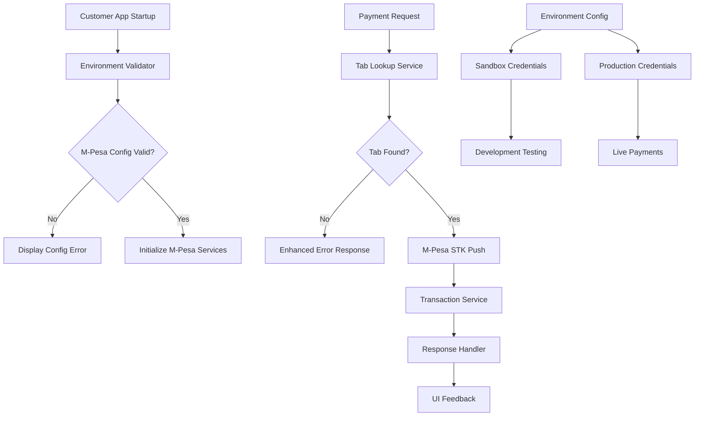

# Design Document: M-Pesa Sandbox Testing Fix

## Overview

This design addresses critical M-Pesa sandbox testing issues in the customer app by implementing proper environment variable configuration, fixing tab lookup failures, and establishing a reliable sandbox testing workflow. The solution focuses on simplifying the M-Pesa integration to align with the straightforward nature of the Daraja API while ensuring robust error handling and diagnostics.

The core issue is that the customer app's M-Pesa payment initiation fails due to missing environment variables, causing "Tab not found" errors and preventing sandbox testing. This design provides a comprehensive solution that maintains the existing architecture while adding proper configuration management and error handling.

## Architecture

### Current Architecture Analysis

The existing M-Pesa integration follows a layered architecture:

1. **UI Layer**: `MpesaPaymentTab.tsx` handles user input and validation
2. **API Layer**: `/api/payments/mpesa/initiate` processes payment requests
3. **Service Layer**: `STKPushService` and `TransactionService` handle M-Pesa communication
4. **Data Layer**: Supabase stores transaction records and tab information

### Identified Issues

1. **Missing Environment Variables**: Customer app lacks M-Pesa configuration in `.env.local`
2. **Configuration Mismatch**: Different apps use different environment variable patterns
3. **Error Propagation**: Tab lookup failures don't provide clear diagnostic information
4. **Environment Validation**: No startup validation of required M-Pesa configuration

### Proposed Architecture Enhancements



## Components and Interfaces

### 1. Environment Configuration Manager

**Purpose**: Centralize M-Pesa environment variable management and validation

**Interface**:
```typescript
interface MpesaEnvironmentConfig {
  consumerKey: string;
  consumerSecret: string;
  businessShortCode: string;
  passkey: string;
  environment: 'sandbox' | 'production';
  callbackUrl: string;
}

interface EnvironmentValidator {
  validateMpesaConfig(): ValidationResult;
  getMissingVariables(): string[];
  generateConfigTemplate(): string;
}
```

**Implementation Location**: `packages/shared/lib/environment-validator.ts` (enhance existing)

### 2. Enhanced Tab Lookup Service

**Purpose**: Improve tab lookup with better error handling and diagnostics

**Interface**:
```typescript
interface TabLookupService {
  findTab(tabId: string): Promise<TabLookupResult>;
  validateTabForPayment(tab: Tab): ValidationResult;
}

interface TabLookupResult {
  success: boolean;
  tab?: Tab;
  error?: string;
  diagnostics?: {
    tabId: string;
    searchAttempted: boolean;
    tabExists: boolean;
    tabStatus?: string;
    customerId?: string;
  };
}
```

### 3. M-Pesa Configuration Service

**Purpose**: Provide environment-specific M-Pesa configuration

**Interface**:
```typescript
interface MpesaConfigService {
  getConfig(environment: 'sandbox' | 'production'): MpesaEnvironmentConfig;
  validateCredentials(config: MpesaEnvironmentConfig): Promise<boolean>;
  isConfigured(): boolean;
}
```

### 4. Enhanced Error Handler

**Purpose**: Provide detailed error information for debugging

**Interface**:
```typescript
interface MpesaErrorHandler {
  handleTabNotFound(tabId: string, diagnostics: any): ErrorResponse;
  handleConfigurationError(missingVars: string[]): ErrorResponse;
  handleApiError(error: MpesaError): ErrorResponse;
}

interface ErrorResponse {
  error: string;
  code: string;
  details?: any;
  suggestions?: string[];
  debugInfo?: any;
}
```

## Data Models

### Environment Configuration

```typescript
interface CustomerAppEnvironment {
  // Existing variables
  NEXT_PUBLIC_SUPABASE_URL: string;
  NEXT_PUBLIC_SUPABASE_PUBLISHABLE_KEY: string;
  SUPABASE_SECRET_KEY: string;
  
  // M-Pesa Configuration (NEW)
  MPESA_CONSUMER_KEY: string;
  MPESA_CONSUMER_SECRET: string;
  MPESA_BUSINESS_SHORTCODE: string;
  MPESA_PASSKEY: string;
  MPESA_ENVIRONMENT: 'sandbox' | 'production';
  MPESA_CALLBACK_URL: string;
  
  // Optional for enhanced debugging
  MPESA_DEBUG_MODE?: boolean;
  NEXT_PUBLIC_APP_URL: string;
}
```

### Enhanced Tab Model

```typescript
interface EnhancedTab extends Tab {
  // Existing fields from database
  id: string;
  customer_id: string;
  status: string;
  
  // Enhanced validation metadata
  paymentEligible: boolean;
  statusReason?: string;
  lastPaymentAttempt?: Date;
}
```

### Diagnostic Information

```typescript
interface PaymentDiagnostics {
  timestamp: Date;
  tabId: string;
  environment: 'sandbox' | 'production';
  configurationStatus: {
    hasConsumerKey: boolean;
    hasConsumerSecret: boolean;
    hasBusinessShortCode: boolean;
    hasPasskey: boolean;
    hasCallbackUrl: boolean;
  };
  tabLookupResult: {
    attempted: boolean;
    found: boolean;
    status?: string;
    customerId?: string;
  };
  errorDetails?: any;
}
```

## Implementation Strategy

### Phase 1: Environment Configuration

1. **Add M-Pesa variables to customer app `.env.local`**
   - Use sandbox credentials for development
   - Follow the same pattern as staff app
   - Include validation and error handling

2. **Enhance Environment Validator**
   - Extend existing validator to check M-Pesa configuration
   - Provide clear error messages for missing variables
   - Generate configuration templates

### Phase 2: Tab Lookup Enhancement

1. **Improve error handling in `/api/payments/mpesa/initiate`**
   - Add detailed diagnostics to tab lookup failures
   - Include tab search metadata in error responses
   - Log diagnostic information for debugging

2. **Enhanced Tab Validation**
   - Validate tab status more thoroughly
   - Check payment eligibility
   - Provide specific error messages for different failure modes

### Phase 3: Configuration Service

1. **Create M-Pesa Configuration Service**
   - Centralize configuration management
   - Support both sandbox and production environments
   - Include credential validation

2. **Integrate with existing services**
   - Update `STKPushService` to use new configuration
   - Ensure backward compatibility
   - Add configuration health checks

### Phase 4: Error Handling and Diagnostics

1. **Enhanced Error Responses**
   - Include diagnostic information in API responses
   - Provide actionable error messages
   - Add debugging information for development

2. **Logging and Monitoring**
   - Log configuration issues at startup
   - Track tab lookup failures
   - Monitor M-Pesa API response patterns

## Correctness Properties

*A property is a characteristic or behavior that should hold true across all valid executions of a system—essentially, a formal statement about what the system should do. Properties serve as the bridge between human-readable specifications and machine-verifiable correctness guarantees.*

### Property Analysis

Based on the requirements analysis, the following properties ensure system correctness:

**Property 1: Environment Configuration Completeness**
*For any* M-Pesa environment configuration, all required variables (consumer key, consumer secret, business shortcode, passkey, environment, callback URL) must be present and non-empty
**Validates: Requirements 1.1, 1.4, 5.1**

**Property 2: Environment Validation at Startup**
*For any* application startup, if M-Pesa environment variables are incomplete or invalid, the validation process must identify and report the specific missing or invalid variables
**Validates: Requirements 1.2, 5.2, 5.4**

**Property 3: Sandbox Environment Isolation**
*For any* M-Pesa API call when environment is set to 'sandbox', only sandbox credentials must be used and production credentials must never be accessed
**Validates: Requirements 1.3, 3.2**

**Property 4: Tab Lookup Success**
*For any* valid tab ID that exists in the database with 'open' status, the tab lookup process must successfully return the tab with complete information
**Validates: Requirements 2.1, 2.3, 2.4**

**Property 5: Payment Initiation Flow**
*For any* valid payment request (valid tab ID, phone number, and amount), the payment initiation process must complete successfully and return confirmation data
**Validates: Requirements 4.1, 4.2, 4.3**

**Property 6: Error Response Quality**
*For any* failed operation (tab lookup, payment initiation, API call), the error response must include descriptive error messages and diagnostic information for debugging
**Validates: Requirements 2.2, 4.4, 6.1, 6.3, 6.4**

**Property 7: Sandbox API Connectivity**
*For any* M-Pesa API call with valid sandbox credentials, the connection to the sandbox environment must succeed and handle sandbox-specific responses correctly
**Validates: Requirements 3.1, 3.3, 3.4**

**Property 8: Configuration Template Generation**
*For any* request for environment variable templates, the generated template must include all required M-Pesa configuration variables with appropriate placeholder values
**Validates: Requirements 5.3**

**Property 9: Diagnostic Tool Accuracy**
*For any* M-Pesa configuration state (valid or invalid), diagnostic tools must correctly identify and report the configuration status and any issues
**Validates: Requirements 6.2**

## Error Handling

### Error Categories

1. **Configuration Errors**
   - Missing environment variables
   - Invalid credential formats
   - Environment mismatch (sandbox vs production)

2. **Tab Lookup Errors**
   - Tab not found
   - Tab not in 'open' status
   - Invalid tab ID format

3. **M-Pesa API Errors**
   - Authentication failures
   - Network connectivity issues
   - Invalid request parameters
   - Sandbox-specific error codes

4. **Validation Errors**
   - Invalid phone number format
   - Invalid amount values
   - Missing required fields

### Error Response Format

```typescript
interface StandardErrorResponse {
  error: string;                    // Human-readable error message
  code: string;                     // Machine-readable error code
  timestamp: Date;                  // When the error occurred
  requestId?: string;               // For tracking and debugging
  details?: {                       // Additional error context
    field?: string;                 // Which field caused the error
    value?: any;                    // The invalid value (sanitized)
    expected?: string;              // What was expected
    suggestions?: string[];         // Actionable suggestions
  };
  diagnostics?: {                   // Debug information (development only)
    environment: string;
    configurationStatus: any;
    tabLookupResult?: any;
    apiResponse?: any;
  };
}
```

### Error Handling Strategy

1. **Fail Fast**: Validate configuration and inputs early
2. **Detailed Logging**: Log all errors with context for debugging
3. **User-Friendly Messages**: Provide clear, actionable error messages
4. **Graceful Degradation**: Handle partial failures without crashing
5. **Debug Information**: Include diagnostic data in development environment

## Testing Strategy

### Dual Testing Approach

The testing strategy employs both unit testing and property-based testing to ensure comprehensive coverage:

**Unit Tests**: Focus on specific examples, edge cases, and error conditions
- Configuration validation with specific missing variables
- Tab lookup with known tab IDs
- Error response format validation
- Integration points between components

**Property Tests**: Verify universal properties across all inputs
- Environment validation across all possible configuration states
- Tab lookup behavior for all valid/invalid tab scenarios
- Payment initiation flow for all valid input combinations
- Error handling consistency across all failure modes

### Property-Based Testing Configuration

- **Testing Library**: Use `fast-check` for TypeScript/JavaScript property-based testing
- **Test Iterations**: Minimum 100 iterations per property test
- **Test Tagging**: Each property test must reference its design document property
- **Tag Format**: `// Feature: mpesa-sandbox-testing-fix, Property {number}: {property_text}`

### Test Categories

1. **Configuration Tests**
   - Environment variable validation
   - Credential format validation
   - Template generation accuracy

2. **Tab Lookup Tests**
   - Valid tab retrieval
   - Invalid tab handling
   - Status validation

3. **Payment Flow Tests**
   - End-to-end payment initiation
   - Error handling in payment flow
   - Response format validation

4. **Integration Tests**
   - M-Pesa API connectivity
   - Database interaction
   - Error propagation

5. **Diagnostic Tests**
   - Configuration diagnostic accuracy
   - Error logging completeness
   - Debug information quality

### Testing Environment Setup

- Use M-Pesa sandbox environment for all tests
- Mock external dependencies where appropriate
- Ensure test isolation and repeatability
- Include both positive and negative test scenarios

The combination of unit and property tests ensures that specific edge cases are covered while also validating that the system behaves correctly across the full range of possible inputs and configurations.