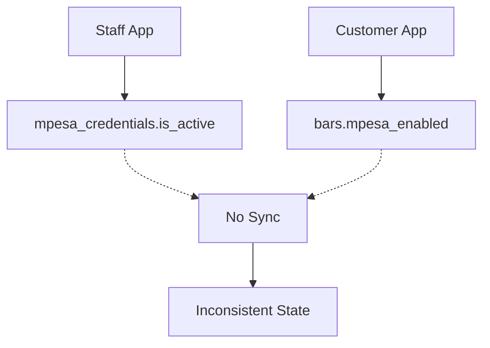
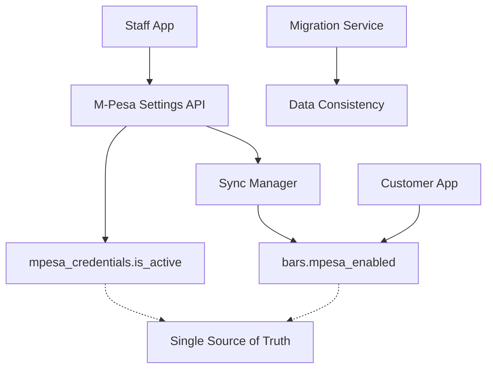
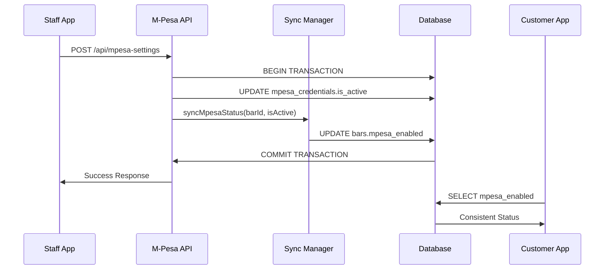

# Design Document: M-Pesa Sync Fix

## Overview

This design addresses the critical synchronization issue between M-Pesa payment availability in the staff app and customer app. Currently, the staff app updates `mpesa_credentials.is_active` while the customer app reads from `bars.mpesa_enabled`, causing inconsistent payment options for customers.

The solution implements a synchronization mechanism that ensures both fields remain consistent, with `mpesa_credentials.is_active` serving as the authoritative source of truth.

## Architecture

### Current State


### Target State


## Components and Interfaces

### 1. Enhanced M-Pesa Settings API

**Location**: `apps/staff/app/api/mpesa-settings/route.ts`

**Current Behavior**: 
- Saves encrypted credentials to `mpesa_credentials` table
- Updates `mpesa_credentials.is_active` field only

**Enhanced Behavior**:
- Maintains existing credential storage functionality
- Adds atomic synchronization of both status fields
- Implements transaction-based updates for consistency

**Interface Changes**:
```typescript
interface MpesaSettingsRequest {
  barId: string;
  mpesa_enabled: boolean;
  mpesa_environment: string;
  mpesa_business_shortcode: string;
  mpesa_consumer_key: string;
  mpesa_consumer_secret: string;
  mpesa_passkey: string;
}

interface MpesaSettingsResponse {
  success: boolean;
  message: string;
  sync_status?: {
    credentials_updated: boolean;
    bar_status_updated: boolean;
  };
}
```

### 2. Sync Manager Component

**Purpose**: Ensures atomic updates to both M-Pesa status fields

**Key Functions**:
```typescript
class MpesaSyncManager {
  async syncMpesaStatus(
    barId: string, 
    isActive: boolean, 
    transaction?: SupabaseClient
  ): Promise<SyncResult>;
  
  async validateSync(barId: string): Promise<ValidationResult>;
  
  async repairInconsistency(barId: string): Promise<RepairResult>;
}

interface SyncResult {
  success: boolean;
  credentialsUpdated: boolean;
  barStatusUpdated: boolean;
  error?: string;
}
```

### 3. Migration Service

**Purpose**: Synchronize existing inconsistent data

**Key Functions**:
```typescript
class MpesaMigrationService {
  async findInconsistentRecords(): Promise<InconsistentRecord[]>;
  
  async migrateRecord(record: InconsistentRecord): Promise<MigrationResult>;
  
  async validateMigration(): Promise<ValidationSummary>;
}

interface InconsistentRecord {
  barId: string;
  credentialsActive: boolean;
  barPaymentEnabled: boolean;
  lastUpdated: string;
}
```

## Data Models

### Database Schema Changes

**No schema changes required** - we will work with existing tables:

1. **mpesa_credentials table** (existing):
   - `tenant_id` (bar_id)
   - `is_active` (authoritative source)
   - Other credential fields

2. **bars table** (existing):
   - `id`
   - `mpesa_enabled` (synchronized target)
   - Other bar fields

### Data Flow



## Correctness Properties

*A property is a characteristic or behavior that should hold true across all valid executions of a system-essentially, a formal statement about what the system should do. Properties serve as the bridge between human-readable specifications and machine-verifiable correctness guarantees.*

Now I need to analyze the acceptance criteria to create correctness properties. Let me use the prework tool.

### Property 1: M-Pesa Status Synchronization
*For any* bar and M-Pesa status value, when the Sync Manager updates M-Pesa settings, both `mpesa_credentials.is_active` and `bars.mpesa_enabled` should have the same value after the operation completes
**Validates: Requirements 1.1, 1.2, 1.3, 1.4**

### Property 2: Migration Consistency Detection
*For any* set of bar records, when the Migration Service runs, it should identify all records where `mpesa_credentials.is_active` and `bars.mpesa_enabled` have different values
**Validates: Requirements 2.1**

### Property 3: Migration Correction Authority
*For any* inconsistent record found during migration, the Migration Service should update `bars.mpesa_enabled` to match `mpesa_credentials.is_active` as the authoritative source
**Validates: Requirements 2.2, 2.3**

### Property 4: Migration Error Resilience
*For any* migration operation that encounters errors, the Migration Service should log detailed error information and continue processing remaining records without stopping
**Validates: Requirements 2.4**

### Property 5: Customer App Payment Display
*For any* bar configuration, when `bars.mpesa_enabled` is true and valid credentials exist, the Customer App should display M-Pesa as an available payment method, and when false, should hide M-Pesa options
**Validates: Requirements 3.1, 3.3, 3.4**

### Property 6: API Atomic Operations
*For any* valid M-Pesa settings request, the API should either successfully update both credential storage and status synchronization, or fail completely with no partial updates, returning appropriate confirmation or error responses
**Validates: Requirements 4.1, 4.2, 4.3**

### Property 7: API Input Validation
*For any* invalid M-Pesa credentials submitted to the API, the request should be rejected and existing status values should remain unchanged
**Validates: Requirements 4.4**

### Property 8: Sync Manager Error Handling
*For any* synchronization failure, the Sync Manager should log the failure, attempt automatic retry, and create alerts for manual intervention if retries fail
**Validates: Requirements 5.1, 5.2, 5.3**

### Property 9: Conflict Resolution Authority
*For any* detected synchronization inconsistency, the Sync Manager should prioritize `mpesa_credentials.is_active` as the authoritative source and correct `bars.mpesa_enabled` accordingly
**Validates: Requirements 5.4**

## Error Handling

### Transaction Management
- All M-Pesa status updates must occur within database transactions
- Failed transactions must rollback completely with no partial updates
- Transaction failures must be logged with detailed error information

### Retry Logic
- Synchronization failures trigger automatic retry with exponential backoff
- Maximum 3 retry attempts before escalating to manual intervention
- Each retry attempt is logged for audit purposes

### Validation Errors
- Invalid credentials are rejected at API level before database operations
- Validation errors return descriptive messages to help staff correct issues
- Existing data remains unchanged when validation fails

### Migration Error Handling
- Migration continues processing even when individual records fail
- Failed record migrations are logged with specific error details
- Post-migration validation identifies any remaining inconsistencies

## Testing Strategy

### Dual Testing Approach

This feature requires both unit testing and property-based testing for comprehensive coverage:

**Unit Tests** focus on:
- Specific examples of M-Pesa settings updates
- Edge cases like empty credentials or invalid bar IDs
- Error conditions and exception handling
- Integration points between API, Sync Manager, and database

**Property Tests** focus on:
- Universal properties that hold for all valid inputs
- Comprehensive input coverage through randomization
- Verification of correctness properties across many scenarios
- Atomic transaction behavior under various conditions

### Property-Based Testing Configuration

- **Testing Library**: Use fast-check for TypeScript/JavaScript property-based testing
- **Test Iterations**: Minimum 100 iterations per property test
- **Test Tagging**: Each property test references its design document property

**Example Test Tags**:
- **Feature: mpesa-sync-fix, Property 1: M-Pesa Status Synchronization**
- **Feature: mpesa-sync-fix, Property 6: API Atomic Operations**

### Test Data Generation

Property tests will generate:
- Random bar IDs and M-Pesa credential combinations
- Various database states (consistent, inconsistent, empty)
- Different error scenarios (network failures, validation errors)
- Edge cases (null values, malformed data, concurrent updates)

### Integration Testing

- Test complete flow from staff app through to customer app
- Verify real-time updates propagate correctly
- Test migration service with realistic data volumes
- Validate error recovery scenarios end-to-end