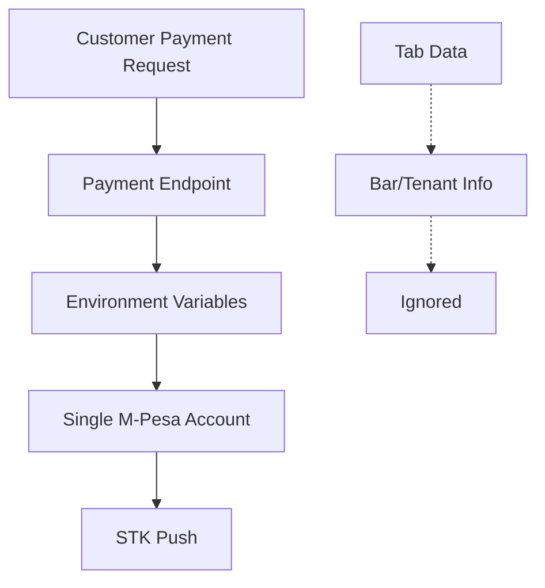
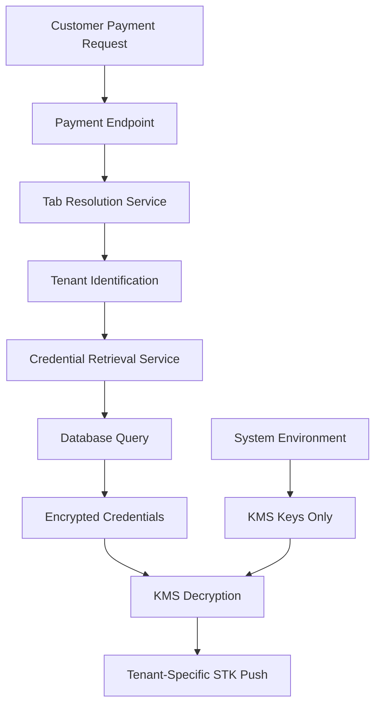

# Design Document: M-Pesa Tenant Credentials Fix

## Overview

This design addresses the critical architectural flaw in the multi-tenant bar management system where M-Pesa payment integration incorrectly uses system-level environment variables instead of tenant-specific encrypted credentials stored in the database. The current implementation hardcodes credentials in the payment initiation endpoint, preventing proper multi-tenancy support.

The solution implements a tenant-aware credential retrieval system that:
1. Resolves the bar/tenant from tab data
2. Retrieves encrypted M-Pesa credentials from the database
3. Decrypts credentials using system-level KMS keys
4. Uses tenant-specific credentials for STK Push operations

## Architecture

### Current Architecture (Problematic)


### New Architecture (Fixed)


## Components and Interfaces

### 1. Tab Resolution Service

**Purpose**: Resolve tab ownership to identify the tenant/bar

```typescript
interface TabResolutionService {
  resolveTabToTenant(tabId: string): Promise<TenantInfo>;
}

interface TenantInfo {
  tenantId: string;
  barId: string;
  barName: string;
  isActive: boolean;
}
```

**Implementation**:
- Query `tabs` table to get `bar_id` 
- Validate tab exists and is in valid state
- Return tenant information for credential lookup

### 2. Credential Retrieval Service

**Purpose**: Fetch and decrypt tenant-specific M-Pesa credentials

```typescript
interface CredentialRetrievalService {
  getTenantCredentials(tenantId: string, environment: MpesaEnvironment): Promise<MpesaCredentials>;
  validateCredentials(credentials: MpesaCredentials): Promise<boolean>;
}

interface EncryptedCredentialRecord {
  id: string;
  tenant_id: string;
  environment: MpesaEnvironment;
  encrypted_consumer_key: string;
  encrypted_consumer_secret: string;
  encrypted_business_shortcode: string;
  encrypted_passkey: string;
  callback_url: string;
  is_active: boolean;
  created_at: Date;
  updated_at: Date;
}
```

**Implementation**:
- Query `mpesa_credentials` table by `tenant_id` and `environment`
- Decrypt credential fields using system KMS key
- Validate credential completeness and format
- Return structured `MpesaCredentials` object

### 3. KMS Decryption Service

**Purpose**: Handle secure decryption of stored credentials

```typescript
interface KMSDecryptionService {
  decrypt(encryptedValue: string): Promise<string>;
  validateDecryption(decryptedValue: string): boolean;
}
```

**Implementation**:
- Use system-level encryption key from environment variables
- Implement secure memory handling for decrypted values
- Clear sensitive data after use
- Handle decryption failures gracefully

### 4. Enhanced Payment Endpoint

**Purpose**: Modified payment initiation with tenant-aware credential resolution

```typescript
interface EnhancedPaymentEndpoint {
  initiatePayment(request: PaymentRequest): Promise<PaymentResponse>;
}

interface PaymentRequest {
  tabId: string;
  phoneNumber: string;
  amount: number;
}

interface PaymentResponse {
  success: boolean;
  transactionId: string;
  checkoutRequestId?: string;
  customerMessage?: string;
  error?: PaymentError;
}

interface PaymentError {
  code: string;
  message: string;
  details?: any;
}
```

## Data Models

### Existing Database Schema (No Changes Required)

**tabs table**:
```sql
-- Existing structure
id: uuid
bar_id: uuid  -- Links to tenant
customer_id: uuid
status: text
-- ... other fields
```

**mpesa_credentials table**:
```sql
-- Existing structure  
id: uuid
tenant_id: uuid  -- Links to bar
environment: text  -- 'sandbox' | 'production'
encrypted_consumer_key: text
encrypted_consumer_secret: text
encrypted_business_shortcode: text
encrypted_passkey: text
callback_url: text
is_active: boolean
created_at: timestamp
updated_at: timestamp
```

### Service Configuration Model

```typescript
interface TenantMpesaConfig extends ServiceConfig {
  tenantId: string;
  barName: string;
  environment: MpesaEnvironment;
  credentials: MpesaCredentials;
  // Inherits: timeoutMs, retryAttempts, rateLimitPerMinute
}
```

## Correctness Properties

*A property is a characteristic or behavior that should hold true across all valid executions of a system—essentially, a formal statement about what the system should do. Properties serve as the bridge between human-readable specifications and machine-verifiable correctness guarantees.*

Based on the prework analysis, I've identified the following testable properties after eliminating redundancy:

### Property 1: Tenant Credential Resolution Flow
*For any* valid tab with an associated bar/tenant, when a payment is initiated, the system should successfully resolve the tab to tenant, retrieve encrypted credentials, decrypt them, and use them for STK Push without accessing environment variables for tenant-specific credentials
**Validates: Requirements 1.1, 1.2, 1.3, 1.4, 1.5**

### Property 2: Credential Encryption Round-Trip
*For any* valid M-Pesa credentials, when stored in encrypted format and later retrieved, the decryption process using the system KMS key should produce the original credential values
**Validates: Requirements 2.1, 2.2**

### Property 3: Credential Validation
*For any* set of M-Pesa credentials, the system should validate that all required fields are present and properly formatted before attempting STK Push operations
**Validates: Requirements 3.5**

### Property 4: Environment Configuration Consistency
*For any* tenant credentials with environment configuration, the system should use the appropriate M-Pesa endpoint (sandbox/production) that matches the credential environment and reject mismatched combinations
**Validates: Requirements 4.1, 4.2, 4.3**

### Property 5: Database Schema Compatibility
*For any* existing credential record in the mpesa_credentials table, the new credential retrieval service should successfully query, decrypt, and use the credentials while maintaining backward compatibility
**Validates: Requirements 5.1, 5.2, 5.3, 5.4**

### Property 6: API Interface Consistency
*For any* payment request, the enhanced payment endpoint should maintain the same API interface, response format, and callback mechanisms regardless of which tenant's credentials are used
**Validates: Requirements 6.1, 6.2, 6.3**

### Property 7: User-Friendly Error Messages
*For any* payment failure due to credential issues, the system should provide user-friendly error messages that don't expose technical details like encryption keys or raw database errors
**Validates: Requirements 6.4**

## Error Handling

### Error Categories and Responses

**1. Tab Resolution Errors**
- Invalid tab ID → `400 Bad Request: "Tab not found"`
- Orphaned tab (no associated bar) → `400 Bad Request: "Invalid tab configuration"`
- Inactive tab → `400 Bad Request: "Tab is not available for payments"`

**2. Credential Retrieval Errors**
- No credentials configured → `503 Service Unavailable: "Payment service not configured for this location"`
- Inactive credentials → `503 Service Unavailable: "Payment service temporarily unavailable"`
- Database connection failure → `503 Service Unavailable: "Payment service temporarily unavailable"`

**3. Decryption Errors**
- Invalid encryption key → `500 Internal Server Error: "Payment configuration error"`
- Corrupted credential data → `500 Internal Server Error: "Payment configuration error"`
- Missing KMS key → `500 Internal Server Error: "Payment service configuration error"`

**4. Validation Errors**
- Incomplete credentials → `503 Service Unavailable: "Payment service configuration incomplete"`
- Invalid credential format → `503 Service Unavailable: "Payment service configuration error"`
- Environment mismatch → `503 Service Unavailable: "Payment service configuration error"`

### Error Logging Strategy

```typescript
interface ErrorContext {
  tabId: string;
  tenantId?: string;
  environment?: MpesaEnvironment;
  errorType: 'TAB_RESOLUTION' | 'CREDENTIAL_RETRIEVAL' | 'DECRYPTION' | 'VALIDATION';
  timestamp: Date;
  requestId: string;
}
```

**Logging Rules**:
- Log all errors with full context for debugging
- Never log decrypted credential values
- Include request correlation IDs for tracing
- Log performance metrics for credential retrieval
- Alert on repeated decryption failures (potential key issues)

## Testing Strategy

### Dual Testing Approach

This feature requires both unit testing and property-based testing to ensure comprehensive coverage:

**Unit Tests** focus on:
- Specific error conditions and edge cases
- Integration points between services
- Database connection handling
- Encryption/decryption with known test vectors
- API response format validation

**Property-Based Tests** focus on:
- Universal properties that hold for all inputs
- Comprehensive input coverage through randomization
- Tenant credential resolution across all possible tab/tenant combinations
- Encryption round-trip properties with generated credentials
- API consistency across different tenant configurations

### Property-Based Testing Configuration

**Testing Library**: Use `fast-check` for TypeScript property-based testing
**Test Configuration**: Minimum 100 iterations per property test
**Test Tagging**: Each property test must reference its design document property

Tag format: **Feature: mpesa-tenant-credentials-fix, Property {number}: {property_text}**

### Test Data Generation

**Tab Generation**:
```typescript
const tabArbitrary = fc.record({
  id: fc.uuid(),
  bar_id: fc.uuid(),
  customer_id: fc.uuid(),
  status: fc.constantFrom('open', 'closed', 'paid')
});
```

**Credential Generation**:
```typescript
const credentialArbitrary = fc.record({
  consumerKey: fc.string({ minLength: 10, maxLength: 50 }),
  consumerSecret: fc.string({ minLength: 10, maxLength: 50 }),
  businessShortCode: fc.string({ minLength: 5, maxLength: 10 }),
  passkey: fc.string({ minLength: 20, maxLength: 100 }),
  environment: fc.constantFrom('sandbox', 'production'),
  callbackUrl: fc.webUrl()
});
```

### Integration Testing

**Database Integration**:
- Test with real database connections
- Verify encryption/decryption with actual KMS keys
- Test transaction rollback on failures
- Validate RLS (Row Level Security) compliance

**M-Pesa API Integration**:
- Test with M-Pesa sandbox environment
- Verify credential validation against actual API
- Test rate limiting and error handling
- Validate callback processing

### Performance Testing

**Credential Retrieval Performance**:
- Target: < 100ms for credential retrieval and decryption
- Load test: 100 concurrent payment initiations
- Memory usage: Monitor for credential data leaks
- Database connection pooling efficiency

**Caching Strategy** (Future Enhancement):
- Consider caching decrypted credentials for short periods
- Implement secure cache invalidation
- Balance security vs. performance trade-offs