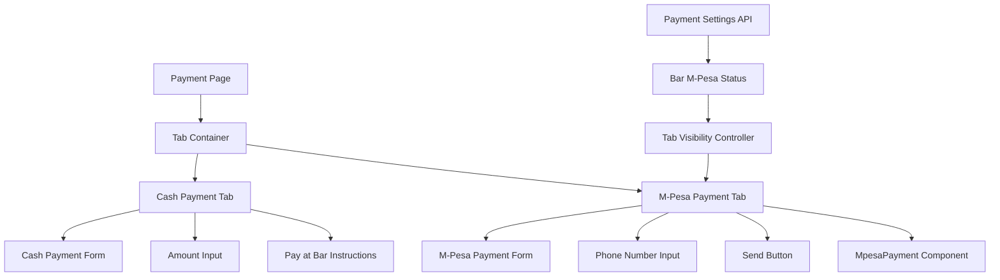

# Design Document: Payment UI Fix

## Overview

This design addresses critical UI issues in the customer payment interface by restructuring the payment method selection from a single-method approach to a proper tabbed interface. The current implementation incorrectly embeds M-Pesa functionality within a generic payment flow and lacks proper separation between cash and M-Pesa payment methods.

The solution involves refactoring the payment page to use distinct tabs for each payment method, implementing proper state management for tab switching, and ensuring M-Pesa visibility is correctly controlled by bar settings.

## Architecture

### Current Architecture Issues

The existing `apps/customer/app/payment/page.tsx` has several architectural problems:
- Payment methods are presented as radio buttons rather than distinct tabs
- M-Pesa functionality is conditionally rendered within a single payment flow
- State management mixes payment method selection with payment processing
- UI shows "coming soon" messages even when M-Pesa is available

### Proposed Architecture



## Components and Interfaces

### 1. Enhanced Payment Page Component

**Location**: `apps/customer/app/payment/page.tsx`

**Key Changes**:
- Replace payment method radio buttons with tab interface
- Implement tab state management
- Separate cash and M-Pesa payment flows
- Remove "coming soon" messaging for enabled payment methods

**New State Variables**:
```typescript
interface PaymentPageState {
  activeTab: 'cash' | 'mpesa';
  paymentAmount: string;
  cashPaymentState: CashPaymentState;
  mpesaPaymentState: MpesaPaymentState;
}

interface CashPaymentState {
  amount: string;
  // Cash-specific state
}

interface MpesaPaymentState {
  phoneNumber: string;
  showMpesaPayment: boolean;
  // M-Pesa specific state
}
```

### 2. Tab Container Component

**New Component**: `apps/customer/components/PaymentTabs.tsx`

**Responsibilities**:
- Render tab headers (Cash Payment, M-Pesa Payment)
- Handle tab switching logic
- Manage active tab state
- Control tab visibility based on payment settings

**Interface**:
```typescript
interface PaymentTabsProps {
  activeTab: 'cash' | 'mpesa';
  onTabChange: (tab: 'cash' | 'mpesa') => void;
  mpesaAvailable: boolean;
  children: React.ReactNode;
}
```

### 3. Cash Payment Tab Component

**New Component**: `apps/customer/components/CashPaymentTab.tsx`

**Responsibilities**:
- Display amount input for cash payments
- Show payment instructions for bar payment
- Handle cash payment state

### 4. M-Pesa Payment Tab Component

**New Component**: `apps/customer/components/MpesaPaymentTab.tsx`

**Responsibilities**:
- Display phone number input with validation
- Show/hide send button based on phone validation
- Integrate with existing MpesaPayment component
- Handle M-Pesa payment state

### 5. Enhanced MpesaPayment Component

**Location**: `apps/customer/components/MpesaPayment.tsx`

**Modifications**:
- Accept partial payment amounts (≤ outstanding balance)
- Improve phone number validation for 0xxxxxxxxx format
- Enhanced real-time validation feedback

## Data Models

### Payment Settings Model

```typescript
interface PaymentSettings {
  paymentMethods: {
    mpesa: {
      available: boolean;
      environment: 'sandbox' | 'production';
    };
    cash: {
      available: boolean; // Always true
    };
  };
}
```

### Tab State Model

```typescript
interface TabState {
  activeTab: 'cash' | 'mpesa';
  cashState: {
    amount: string;
    isValid: boolean;
  };
  mpesaState: {
    phoneNumber: string;
    isValid: boolean;
    showPaymentInterface: boolean;
  };
}
```

## Correctness Properties

*A property is a characteristic or behavior that should hold true across all valid executions of a system-essentially, a formal statement about what the system should do. Properties serve as the bridge between human-readable specifications and machine-verifiable correctness guarantees.*

### Property 1: Tab Structure and Separation
*For any* payment interface state, exactly two distinct tabs should be displayed ("Cash Payment" and "M-Pesa Payment") with completely separate, non-overlapping content areas where M-Pesa options never appear in Cash Payment tab content.
**Validates: Requirements 1.1, 1.2, 1.4**

### Property 2: Tab Switching Behavior
*For any* tab click operation, only the content relevant to the selected payment method should be displayed while the other tab's content is hidden.
**Validates: Requirements 1.3**

### Property 3: M-Pesa Tab Visibility Control
*For any* bar with M-Pesa enabled in settings, the M-Pesa Payment tab should be visible, clickable, and no "coming soon" message should be displayed.
**Validates: Requirements 2.1, 2.3, 2.4**

### Property 4: M-Pesa Tab Hiding
*For any* bar without M-Pesa enabled in settings, the M-Pesa Payment tab should be hidden from the interface.
**Validates: Requirements 2.2**

### Property 5: M-Pesa Tab Content Requirements
*For any* active M-Pesa Payment tab, a phone number input field should be displayed.
**Validates: Requirements 3.1**

### Property 6: Phone Number Validation and Feedback
*For any* phone number input, both 0xxxxxxxxx and 254xxxxxxxxx formats should be validated as correct, real-time validation feedback should be provided, and invalid numbers should trigger appropriate error messages.
**Validates: Requirements 3.5, 3.6, 3.7**

### Property 7: Send Button Visibility and Functionality
*For any* valid phone number entered in the M-Pesa input field, a "Send" button should be displayed, remain visible and functional, and initiate the M-Pesa payment process when clicked.
**Validates: Requirements 3.2, 3.3, 3.4**

### Property 8: Tab State Management
*For any* tab switch operation, the active tab should preserve its own input values while clearing the inactive tab's state, maintaining appropriate state isolation between payment methods.
**Validates: Requirements 4.1, 4.2, 4.3, 4.4**

### Property 9: Partial Payment Validation
*For any* M-Pesa payment amount input, the system should accept any value that is greater than 0 and less than or equal to the outstanding balance.
**Validates: Requirements 1.5**

## Error Handling

### Tab Switching Errors
- **Scenario**: Tab switching fails due to state corruption
- **Handling**: Reset to default tab (Cash) and clear all form state
- **User Feedback**: Toast notification about interface reset

### Payment Settings Loading Errors
- **Scenario**: Unable to fetch bar payment settings
- **Handling**: Default to cash-only mode with error message
- **User Feedback**: Clear error message with retry option

### M-Pesa Availability Errors
- **Scenario**: M-Pesa settings are inconsistent or corrupted
- **Handling**: Hide M-Pesa tab and log error for debugging
- **User Feedback**: Show cash payment option only

### Phone Number Validation Errors
- **Scenario**: Invalid phone number formats or validation failures
- **Handling**: Provide real-time feedback with correction suggestions
- **User Feedback**: Inline validation messages with format examples

## Testing Strategy

### Unit Testing Approach
- **Tab Component Tests**: Verify tab rendering, switching, and visibility logic
- **State Management Tests**: Test state isolation between tabs
- **Validation Tests**: Test phone number validation for both formats
- **Integration Tests**: Test payment settings integration with tab visibility

### Property-Based Testing Approach
- **Property Tests**: Verify universal properties across all input combinations
- **Configuration**: Minimum 100 iterations per property test
- **Library**: Use fast-check for TypeScript property-based testing
- **Test Tags**: Each test references its design document property

**Property Test Examples**:
```typescript
// Feature: payment-ui-fix, Property 1: Tab Separation
test('payment tabs are always distinct and non-overlapping', () => {
  fc.assert(fc.property(
    fc.record({
      mpesaAvailable: fc.boolean(),
      activeTab: fc.constantFrom('cash', 'mpesa')
    }),
    (config) => {
      const tabs = renderPaymentTabs(config);
      expect(tabs.cashTab.isVisible !== tabs.mpesaTab.isVisible || 
             (tabs.cashTab.isVisible && tabs.mpesaTab.isVisible)).toBe(true);
      expect(tabs.cashTab.content).not.toEqual(tabs.mpesaTab.content);
    }
  ));
});
```

### Testing Balance
- **Unit tests**: Focus on specific component behaviors, edge cases, and error conditions
- **Property tests**: Verify universal correctness properties across all valid inputs
- **Integration tests**: Test component interactions and API integrations
- Both approaches are complementary and necessary for comprehensive coverage