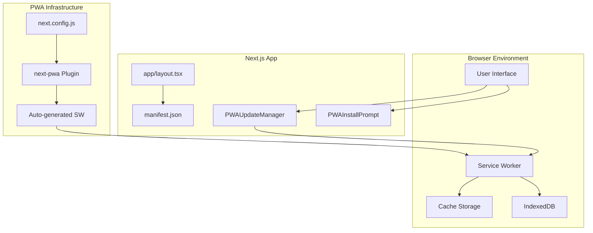
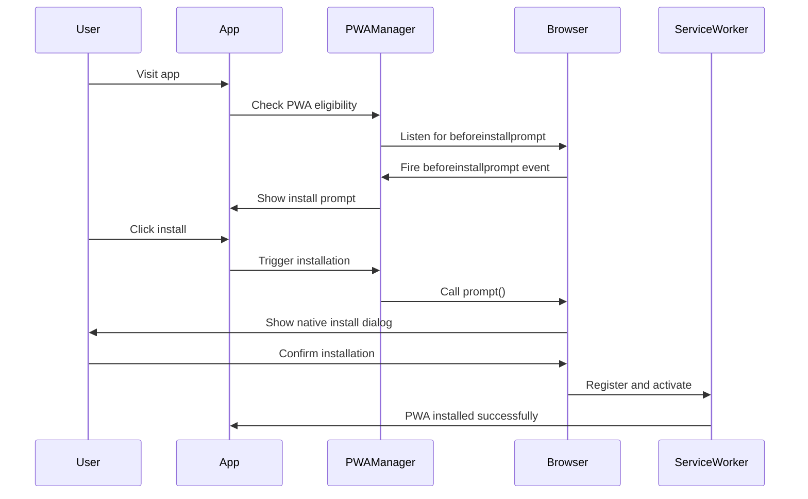

# Design Document: PWA Customer App Fix

## Overview

This design addresses the critical PWA functionality issues in the customer app by implementing a comprehensive solution that eliminates service worker conflicts, restores proper install/uninstall capabilities, and provides robust offline support. The solution leverages Next.js built-in PWA capabilities while ensuring proper cleanup of legacy configurations.

The design follows a systematic approach to:
1. Clean up existing service worker conflicts
2. Implement proper PWA configuration using Next.js best practices
3. Restore install/uninstall functionality with proper error handling
4. Enable development mode testing
5. Provide comprehensive offline support with fallback strategies

## Architecture

### High-Level Architecture



### Service Worker Strategy

The design implements a single, auto-generated service worker approach:
- **Primary**: Use next-pwa auto-generated service worker
- **Cleanup**: Remove all manual service worker registrations
- **Conflict Resolution**: Implement cleanup logic to unregister conflicting workers
- **Caching Strategy**: Implement cache-first for static assets, network-first for dynamic content

### PWA Installation Flow



## Components and Interfaces

### 1. PWA Configuration Manager

**Location**: `next.config.js`
**Purpose**: Central PWA configuration using next-pwa plugin

```typescript
interface PWAConfig {
  dest: string;
  disable: boolean;
  register: boolean;
  skipWaiting: boolean;
  clientsClaim: boolean;
  sw: string;
  publicExcludes: string[];
  buildExcludes: RegExp[];
  cacheOnFrontEndNav: boolean;
  reloadOnOnline: boolean;
  swcMinify: boolean;
  workboxOptions: WorkboxOptions;
}

interface WorkboxOptions {
  runtimeCaching: RuntimeCachingEntry[];
  skipWaiting: boolean;
  clientsClaim: boolean;
  cleanupOutdatedCaches: boolean;
}
```

### 2. PWA Update Manager

**Location**: `components/PWAUpdateManager.tsx`
**Purpose**: Handle service worker lifecycle and updates

```typescript
interface PWAUpdateManagerProps {
  children: React.ReactNode;
}

interface ServiceWorkerState {
  isUpdateAvailable: boolean;
  isInstalling: boolean;
  registration: ServiceWorkerRegistration | null;
  error: string | null;
}

class PWAUpdateManager {
  // Remove manual registration logic
  // Implement update detection
  // Handle service worker lifecycle events
  // Provide cleanup utilities
}
```

### 3. PWA Install Prompt

**Location**: `components/PWAInstallPrompt.tsx`
**Purpose**: Handle PWA installation UI and logic

```typescript
interface PWAInstallPromptState {
  canInstall: boolean;
  isInstalled: boolean;
  isInstalling: boolean;
  error: string | null;
  deferredPrompt: BeforeInstallPromptEvent | null;
}

interface PWAInstallPromptProps {
  onInstallSuccess?: () => void;
  onInstallError?: (error: Error) => void;
  customTrigger?: React.ReactNode;
}
```

### 4. Cache Management Service

**Purpose**: Handle cache cleanup and management

```typescript
interface CacheManager {
  clearAllCaches(): Promise<void>;
  clearSpecificCache(cacheName: string): Promise<void>;
  getCacheNames(): Promise<string[]>;
  getCacheSize(): Promise<number>;
  cleanupOldCaches(currentVersion: string): Promise<void>;
}

interface UninstallCleanup {
  clearServiceWorkerCaches(): Promise<void>;
  clearLocalStorage(): Promise<void>;
  clearIndexedDB(): Promise<void>;
  unregisterServiceWorkers(): Promise<void>;
}
```

### 5. Offline Fallback System

**Purpose**: Provide meaningful offline experiences

```typescript
interface OfflineFallback {
  fallbackPage: string;
  offlineAssets: string[];
  criticalResources: string[];
  fallbackStrategies: Map<string, CacheStrategy>;
}

enum CacheStrategy {
  CACHE_FIRST = 'cache-first',
  NETWORK_FIRST = 'network-first',
  STALE_WHILE_REVALIDATE = 'stale-while-revalidate',
  NETWORK_ONLY = 'network-only',
  CACHE_ONLY = 'cache-only'
}
```

## Data Models

### PWA Manifest Structure

```typescript
interface PWAManifest {
  name: string;
  short_name: string;
  description: string;
  start_url: string;
  display: 'standalone' | 'fullscreen' | 'minimal-ui' | 'browser';
  background_color: string;
  theme_color: string;
  orientation: 'portrait' | 'landscape' | 'any';
  icons: PWAIcon[];
  categories: string[];
  lang: string;
  dir: 'ltr' | 'rtl' | 'auto';
  scope: string;
}

interface PWAIcon {
  src: string;
  sizes: string;
  type: string;
  purpose?: 'any' | 'maskable' | 'monochrome';
}
```

### Service Worker Registration State

```typescript
interface ServiceWorkerRegistrationState {
  registration: ServiceWorkerRegistration | null;
  installing: ServiceWorker | null;
  waiting: ServiceWorker | null;
  active: ServiceWorker | null;
  controller: ServiceWorker | null;
  updateFound: boolean;
  controllerChanged: boolean;
}
```

### Cache Storage Schema

```typescript
interface CacheEntry {
  url: string;
  timestamp: number;
  version: string;
  strategy: CacheStrategy;
  maxAge?: number;
}

interface CacheMetadata {
  version: string;
  created: number;
  lastAccessed: number;
  size: number;
  entries: CacheEntry[];
}
```

## Implementation Strategy

### Phase 1: Cleanup and Configuration

1. **Remove Conflicting Service Workers**
   - Delete manual service worker files
   - Remove manual registration code from PWAUpdateManager
   - Implement cleanup logic for existing registrations

2. **Configure next-pwa Plugin**
   - Update next.config.js with proper PWA configuration
   - Enable development mode PWA testing
   - Configure workbox options for caching strategies

3. **Update Manifest and Icons**
   - Audit existing manifest.json for missing icons
   - Generate missing icon sizes using PWA asset generators
   - Update manifest with correct icon references

### Phase 2: Core PWA Functionality

1. **Implement PWA Installation Logic**
   - Update PWAInstallPrompt with proper error handling
   - Add installation state management
   - Implement cross-platform installation detection

2. **Add Uninstallation Support**
   - Create uninstall cleanup utilities
   - Implement cache clearing on uninstall
   - Add service worker cleanup logic

3. **Enable Development Testing**
   - Configure next-pwa for development mode
   - Add HTTPS setup guidance for local testing
   - Implement development-specific debugging

### Phase 3: Offline and Performance

1. **Implement Offline Fallbacks**
   - Create offline fallback pages
   - Configure runtime caching strategies
   - Add network status detection

2. **Add Performance Optimizations**
   - Implement cache versioning and cleanup
   - Add preloading for critical resources
   - Configure background sync capabilities

### Phase 4: Meta Tags and Mobile Support

1. **Add Required Meta Tags**
   - Implement iOS-specific PWA meta tags
   - Add Android-specific PWA meta tags
   - Configure viewport and display settings

2. **Mobile Platform Optimization**
   - Add splash screen configurations
   - Implement status bar styling
   - Configure theme colors and display modes

Now I need to use the prework tool to analyze the acceptance criteria before writing the Correctness Properties section.

## Correctness Properties

*A property is a characteristic or behavior that should hold true across all valid executions of a system—essentially, a formal statement about what the system should do. Properties serve as the bridge between human-readable specifications and machine-verifiable correctness guarantees.*

Based on the prework analysis and property reflection, the following properties validate the core correctness requirements for the PWA customer app fix:

### Service Worker Management Properties

**Property 1: Single Service Worker Registration**
*For any* PWA app initialization, only one service worker should be registered and active, regardless of configuration conflicts or previous registrations
**Validates: Requirements 1.1, 8.1, 8.4**

**Property 2: Conflicting Registration Cleanup**
*For any* PWA app with existing conflicting service worker registrations, the cleanup process should remove all conflicts and leave only the correct next-pwa auto-generated worker
**Validates: Requirements 1.2, 8.2**

**Property 3: Caching Strategy Implementation**
*For any* resource request, the service worker should apply cache-first strategy for static assets and network-first strategy for dynamic content, with proper fallback to cached versions when resources fail
**Validates: Requirements 1.3, 7.4, 7.5**

**Property 4: Next-PWA Priority**
*For any* PWA configuration with both next-pwa and manual registration present, the system should prioritize next-pwa auto-generation and remove manual registrations
**Validates: Requirements 1.5, 8.5**

### Installation Management Properties

**Property 5: Installation Prompt Display**
*For any* PWA that meets installation criteria and is not already installed, the installation prompt should be displayed to users
**Validates: Requirements 2.1, 2.4**

**Property 6: Installation Process Handling**
*For any* user-triggered PWA installation, the system should complete the installation process and provide appropriate feedback for both success and failure cases
**Validates: Requirements 2.2, 2.3**

**Property 7: Installation Feature Detection**
*For any* browser environment, PWA installation features should be enabled if and only if the browser supports PWA installation
**Validates: Requirements 2.5**

### Uninstallation and Cleanup Properties

**Property 8: Complete Uninstallation Cleanup**
*For any* PWA uninstallation, all cached data, storage, user preferences, and temporary data should be completely removed from the device
**Validates: Requirements 3.1, 3.3**

**Property 9: Service Worker Unregistration**
*For any* PWA uninstallation, the service worker should unregister itself and clean up all background processes
**Validates: Requirements 3.2**

**Property 10: Cleanup Verification**
*For any* cleanup operation, the system should verify all caches are properly removed, and if cleanup fails, should log errors and attempt partial cleanup
**Validates: Requirements 3.4, 3.5**

### Manifest and Asset Properties

**Property 11: Manifest Asset Validation**
*For any* PWA manifest, all referenced icon files should exist, be in correct sizes and formats, and all referenced assets should be accessible
**Validates: Requirements 4.1, 4.3**

**Property 12: Manifest Completeness**
*For any* PWA manifest, all required metadata fields (name, short_name, theme_color, background_color) should be present and valid
**Validates: Requirements 4.4**

**Property 13: Icon Fallback Handling**
*For any* PWA with missing icon files, the system should provide fallback icons or generate placeholder icons
**Validates: Requirements 4.5**

### Mobile Platform Properties

**Property 14: Comprehensive Meta Tag Validation**
*For any* PWA app, all required iOS-specific meta tags, Android-specific meta tags, viewport configuration, theme color, status bar style, and display mode meta tags should be present and correctly configured
**Validates: Requirements 5.1, 5.2, 5.3, 5.5**

### Development Mode Properties

**Property 15: Development Mode PWA Features**
*For any* PWA running in development mode, PWA features should be enabled for local testing, service worker should function properly, debugging information should be provided, and installation should work from localhost
**Validates: Requirements 6.1, 6.2, 6.3, 6.4**

### Offline Functionality Properties

**Property 16: Offline Content Serving**
*For any* PWA that goes offline, cached content should be displayed instead of blank screens, and meaningful offline fallback pages should be provided for uncached routes
**Validates: Requirements 7.1, 7.2**

**Property 17: Network Restoration Sync**
*For any* PWA that regains network connectivity after being offline, the service worker should sync any pending data or updates
**Validates: Requirements 7.3**

**Property 18: Configuration Update Handling**
*For any* PWA configuration change, the service worker registration should be properly updated to reflect the new configuration
**Validates: Requirements 8.3**

## Error Handling

### Service Worker Error Handling

1. **Registration Failures**: Implement retry logic with exponential backoff for service worker registration failures
2. **Update Failures**: Provide user feedback when service worker updates fail and offer manual retry options
3. **Cache Failures**: Gracefully handle cache storage failures and fall back to network requests
4. **Cleanup Failures**: Log detailed error information and attempt partial cleanup when full cleanup fails

### Installation Error Handling

1. **Browser Compatibility**: Detect unsupported browsers and provide appropriate messaging
2. **Installation Rejection**: Handle user rejection of installation prompts gracefully
3. **Platform Limitations**: Provide platform-specific guidance for installation issues
4. **Network Failures**: Handle installation failures due to network issues with retry mechanisms

### Offline Error Handling

1. **Resource Loading**: Implement comprehensive fallback strategies for failed resource loading
2. **Data Synchronization**: Handle sync failures with queuing and retry mechanisms
3. **Storage Limitations**: Manage cache storage quota exceeded errors
4. **Network Detection**: Implement reliable online/offline status detection

### Development Error Handling

1. **HTTPS Requirements**: Provide clear guidance for HTTPS setup in development
2. **Configuration Errors**: Validate PWA configuration and provide helpful error messages
3. **Asset Missing**: Detect and report missing PWA assets during development
4. **Debug Information**: Provide comprehensive debugging information in development mode

## Testing Strategy

### Dual Testing Approach

The testing strategy employs both unit tests and property-based tests to ensure comprehensive coverage:

**Unit Tests**: Focus on specific examples, edge cases, and error conditions including:
- Specific service worker registration scenarios
- Installation prompt UI interactions
- Manifest parsing edge cases
- Cache cleanup verification
- Error handling scenarios

**Property-Based Tests**: Verify universal properties across all inputs including:
- Service worker behavior across different configurations
- Installation flows across different browser environments
- Cache management across different content types
- Cleanup operations across different data states
- Meta tag validation across different platform requirements

### Property-Based Testing Configuration

- **Testing Library**: Use `fast-check` for JavaScript/TypeScript property-based testing
- **Test Iterations**: Minimum 100 iterations per property test to ensure comprehensive coverage
- **Test Tagging**: Each property test must reference its design document property using the format:
  - **Feature: pwa-customer-fix, Property {number}: {property_text}**

### Testing Environment Setup

1. **Development Testing**: Configure HTTPS for local PWA testing
2. **Browser Testing**: Test across Chrome, Firefox, Safari, and Edge
3. **Mobile Testing**: Test on iOS Safari and Android Chrome
4. **Offline Testing**: Simulate offline conditions for offline functionality testing
5. **Service Worker Testing**: Use service worker testing utilities for lifecycle testing

### Integration Testing

1. **End-to-End PWA Flow**: Test complete installation, usage, and uninstallation flow
2. **Cross-Browser Compatibility**: Verify PWA functionality across different browsers
3. **Mobile Platform Integration**: Test PWA behavior on actual mobile devices
4. **Performance Testing**: Verify cache performance and offline loading times
5. **Update Flow Testing**: Test service worker update and cache invalidation flows