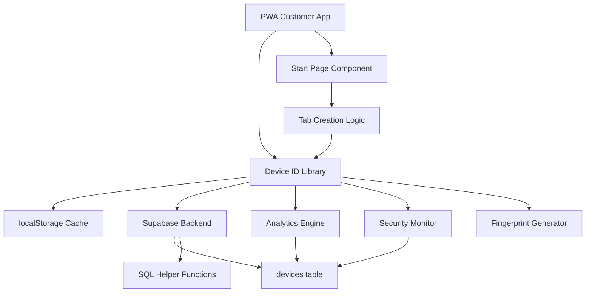
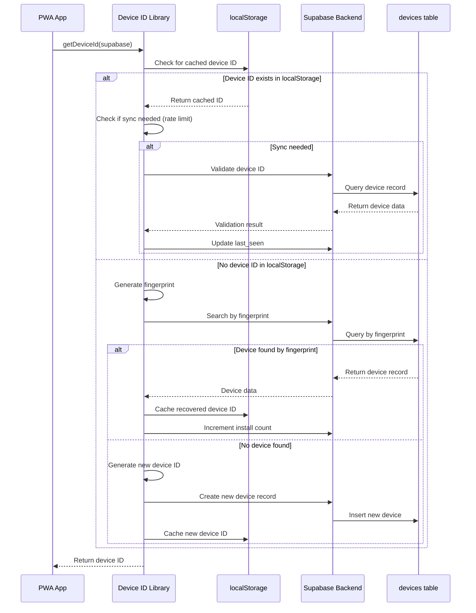

# Design Document

## Overview

This design document outlines the enhancements needed to complete the existing Supabase-backed device ID system for PWA persistence. The current system has a solid foundation with a devices table, basic helper functions, and partial implementation, but requires completion of async operations, fingerprint-based recovery, analytics tracking, and PWA installation issue resolution.

The enhanced system will provide robust device identification that survives PWA reinstalls, supports multi-venue operations, includes comprehensive analytics, and maintains security through fraud detection mechanisms.

## Architecture

### High-Level Architecture



### Component Interaction Flow



## Components and Interfaces

### Enhanced Device ID Library

The core `deviceId.ts` library will be enhanced to provide async operations and complete Supabase integration:

```typescript
// Enhanced Device ID Library Interface
export interface DeviceInfo {
  deviceId: string;
  fingerprint: string;
  createdAt: string;
  lastSeen: string;
  installCount: number;
  totalTabsCreated: number;
  totalAmountSpent: number;
  isActive: boolean;
  isSuspicious: boolean;
}

export interface DeviceAnalytics {
  totalTabs: number;
  totalSpent: number;
  barsVisited: number;
  avgTabAmount: number;
  firstVisit: string;
  lastVisit: string;
  daysActive: number;
}

// Main async functions
export async function getDeviceId(supabase: SupabaseClient): Promise<string>;
export async function getDeviceInfo(supabase: SupabaseClient): Promise<DeviceInfo>;
export async function getDeviceAnalytics(supabase: SupabaseClient): Promise<DeviceAnalytics>;

// Utility functions
export function getBrowserFingerprint(): string;
export async function validateDeviceForNewTab(barId: string, supabase: SupabaseClient): Promise<ValidationResult>;
export function clearDeviceId(): void;

// Enhanced bar device functions
export async function getBarDeviceKey(barId: string, supabase: SupabaseClient): Promise<string>;
export async function hasOpenTabAtBar(barId: string, supabase: SupabaseClient): Promise<TabCheckResult>;
```

### Fingerprint Generator

Enhanced fingerprint generation using stable device characteristics:

```typescript
interface FingerprintData {
  userAgent: string;
  language: string;
  platform: string;
  hardwareConcurrency: number;
  deviceMemory?: number;
  screenResolution: string;
  timezone: string;
  canvasFingerprint: string;
  webglFingerprint?: string;
  audioFingerprint?: string;
}

function generateStableFingerprint(): string {
  // Combine multiple device characteristics
  // Use consistent hashing algorithm
  // Handle edge cases for server-side rendering
}
```

### Analytics Engine

Component for tracking device activity and generating insights:

```typescript
interface AnalyticsEngine {
  recordVenueVisit(deviceId: string, barId: string): Promise<void>;
  recordTransaction(deviceId: string, barId: string, amount: number): Promise<void>;
  getDeviceActivity(deviceId: string): Promise<DeviceAnalytics>;
  getVenueAnalytics(barId: string): Promise<VenueAnalytics>;
}
```

### Security Monitor

Component for detecting suspicious patterns and fraud prevention:

```typescript
interface SecurityMonitor {
  flagSuspiciousDevice(deviceId: string, reason: string): Promise<void>;
  detectSuspiciousPatterns(): Promise<SuspiciousDevice[]>;
  validateDeviceIntegrity(deviceId: string, fingerprint: string): Promise<boolean>;
  auditDeviceActivity(deviceId: string): Promise<AuditEntry[]>;
}
```

## Data Models

### Enhanced Devices Table Schema

The existing devices table needs additional columns for analytics and security:

```sql
-- Additional columns to add to existing devices table
ALTER TABLE public.devices ADD COLUMN IF NOT EXISTS install_count INTEGER DEFAULT 1;
ALTER TABLE public.devices ADD COLUMN IF NOT EXISTS last_install_at TIMESTAMPTZ DEFAULT NOW();
ALTER TABLE public.devices ADD COLUMN IF NOT EXISTS total_tabs_created INTEGER DEFAULT 0;
ALTER TABLE public.devices ADD COLUMN IF NOT EXISTS total_amount_spent DECIMAL(10,2) DEFAULT 0.00;
ALTER TABLE public.devices ADD COLUMN IF NOT EXISTS is_suspicious BOOLEAN DEFAULT false;
ALTER TABLE public.devices ADD COLUMN IF NOT EXISTS metadata JSONB DEFAULT '{}';
```

### Device Analytics Data Model

```typescript
interface DeviceRecord {
  id: string;
  device_id: string;
  fingerprint: string;
  user_id?: string;
  created_at: string;
  last_seen: string;
  last_bar_id?: string;
  is_active: boolean;
  suspicious_activity_count: number;
  install_count: number;
  last_install_at: string;
  total_tabs_created: number;
  total_amount_spent: number;
  is_suspicious: boolean;
  user_agent?: string;
  platform?: string;
  screen_resolution?: string;
  timezone?: string;
  metadata: Record<string, any>;
}
```

### Rate Limiting Data Model

```typescript
interface RateLimitState {
  lastSyncTime: number;
  syncInterval: number; // 5 minutes = 300000ms
  pendingOperations: PendingOperation[];
}

interface PendingOperation {
  type: 'update_last_seen' | 'increment_install' | 'record_analytics';
  data: any;
  timestamp: number;
}
```

## Error Handling

### Error Types and Recovery Strategies

```typescript
enum DeviceError {
  SUPABASE_UNAVAILABLE = 'SUPABASE_UNAVAILABLE',
  FINGERPRINT_COLLISION = 'FINGERPRINT_COLLISION',
  DEVICE_NOT_FOUND = 'DEVICE_NOT_FOUND',
  RATE_LIMIT_EXCEEDED = 'RATE_LIMIT_EXCEEDED',
  VALIDATION_FAILED = 'VALIDATION_FAILED',
  PWA_INSTALL_FAILED = 'PWA_INSTALL_FAILED'
}

interface ErrorRecoveryStrategy {
  [DeviceError.SUPABASE_UNAVAILABLE]: () => Promise<string>; // Fallback to localStorage
  [DeviceError.FINGERPRINT_COLLISION]: (fingerprint: string) => Promise<string>; // Use disambiguation
  [DeviceError.DEVICE_NOT_FOUND]: () => Promise<string>; // Create new device
  [DeviceError.RATE_LIMIT_EXCEEDED]: () => Promise<string>; // Return cached value
  [DeviceError.VALIDATION_FAILED]: () => Promise<string>; // Clear and recreate
  [DeviceError.PWA_INSTALL_FAILED]: () => Promise<void>; // Log and continue
}
```

### Offline Handling

```typescript
interface OfflineManager {
  isOnline(): boolean;
  queueOperation(operation: PendingOperation): void;
  syncPendingOperations(): Promise<void>;
  getOfflineDeviceId(): string;
}
```

## Testing Strategy

### Dual Testing Approach

The testing strategy combines unit tests for specific scenarios with property-based tests for comprehensive coverage:

**Unit Testing Focus:**
- Specific device ID generation scenarios
- Error handling and fallback mechanisms
- PWA installation event handling
- Integration points with existing components
- Edge cases like fingerprint collisions

**Property-Based Testing Focus:**
- Universal properties that must hold across all device operations
- Comprehensive input coverage through randomization
- Validation of correctness properties across different device states

**Property-Based Testing Configuration:**
- Use `fast-check` library for TypeScript property-based testing
- Configure each test to run minimum 100 iterations
- Tag each test with feature and property references
- Format: `// Feature: supabase-device-id-system, Property {number}: {property_text}`

### Test Environment Setup

```typescript
// Test configuration for property-based testing
import fc from 'fast-check';

const deviceIdArbitrary = fc.string({ minLength: 20, maxLength: 50 });
const fingerprintArbitrary = fc.string({ minLength: 10, maxLength: 40 });
const supabaseClientMock = createSupabaseMock();

// Example property test structure
describe('Device ID System Properties', () => {
  it('should maintain device ID consistency', async () => {
    await fc.assert(fc.asyncProperty(
      deviceIdArbitrary,
      async (deviceId) => {
        // Property test implementation
      }
    ), { numRuns: 100 });
  });
});
```

## Correctness Properties

*A property is a characteristic or behavior that should hold true across all valid executions of a system—essentially, a formal statement about what the system should do. Properties serve as the bridge between human-readable specifications and machine-verifiable correctness guarantees.*

Based on the prework analysis and property reflection, the following correctness properties have been identified to validate the device ID system behavior:

### Property 1: Device ID Recovery Consistency
*For any* device that has been created in the system, when localStorage is cleared or the PWA is reinstalled, the device ID should be recoverable through fingerprint matching and restored to localStorage
**Validates: Requirements 1.1, 1.4, 2.2, 11.2**

### Property 2: Dual Storage Consistency  
*For any* new device creation, the device ID should exist in both localStorage and Supabase backend, with localStorage serving as the primary source when available
**Validates: Requirements 1.2, 1.3**

### Property 3: Device Persistence Across Updates
*For any* device, PWA updates, browser updates, or refreshes should maintain device ID continuity without creating duplicate records
**Validates: Requirements 1.5, 11.3**

### Property 4: Fingerprint Generation Completeness
*For any* device environment, the generated fingerprint should contain all required characteristics (screen resolution, timezone, browser features) and remain stable across sessions
**Validates: Requirements 2.1, 2.3**

### Property 5: Fingerprint Collision Handling
*For any* set of devices with similar fingerprints, the system should use disambiguation factors to maintain unique device identification
**Validates: Requirements 2.4**

### Property 6: Fingerprint Update Consistency
*For any* device where characteristics change, the fingerprint should be updated in the backend while maintaining device identity
**Validates: Requirements 2.5**

### Property 7: Analytics Recording Completeness
*For any* device activity (venue visits, transactions), all events should be recorded with correct timestamps, venue information, and spending amounts, maintaining accurate totals
**Validates: Requirements 3.1, 3.2, 3.3, 3.4**

### Property 8: Analytics Privacy Preservation
*For any* analytics data request, aggregated statistics should be provided while maintaining individual privacy constraints
**Validates: Requirements 3.5**

### Property 9: Security Pattern Detection
*For any* device exhibiting suspicious patterns (unusual spending, high creation frequency, identical fingerprints from different locations), the security monitor should detect and flag the activity
**Validates: Requirements 4.1, 4.2, 4.3**

### Property 10: Security Incident Logging
*For any* suspicious activity detection, incidents should be logged with complete audit trails and appropriate access restrictions applied
**Validates: Requirements 4.4, 4.5**

### Property 11: Rate Limiting Enforcement
*For any* device, sync operations with Supabase should be limited to once every 5 minutes, with queuing and caching mechanisms reducing database load
**Validates: Requirements 5.1, 5.2, 5.3**

### Property 12: Timeout and Fallback Behavior
*For any* slow or unresponsive Supabase backend, operations should timeout after 10 seconds and fall back to cached data or localStorage
**Validates: Requirements 5.4, 5.5**

### Property 13: Offline Operation Continuity
*For any* period when Supabase is unavailable, the system should operate using localStorage with queued operations syncing when connectivity is restored
**Validates: Requirements 6.1, 6.2, 6.4**

### Property 14: Connectivity Status Awareness
*For any* network connectivity change, the system should detect the status change and adjust behavior with appropriate user indicators
**Validates: Requirements 6.3, 6.5**

### Property 15: Multi-venue Tab Management
*For any* device, active tabs at multiple venues should coexist independently with venue-specific tracking and device-level analytics aggregation
**Validates: Requirements 7.1, 7.2, 7.3, 7.4, 7.5**

### Property 16: Comprehensive Audit Trail
*For any* device operation (creation, recovery, modification), complete audit logs should be maintained with timestamps, before/after states, and retention policy compliance
**Validates: Requirements 8.1, 8.2, 8.3, 8.4, 8.5**

### Property 17: Database Schema Integrity
*For any* database migration or schema change, existing data should be preserved while new functionality is enabled through proper column additions and function deployments
**Validates: Requirements 9.2, 9.4, 9.5**

### Property 18: Async Integration Compatibility
*For any* existing tab creation or management operation, the conversion to async device ID operations should maintain backward compatibility without breaking functionality
**Validates: Requirements 10.2, 10.4**

### Property 19: Error Handling Robustness
*For any* Supabase unavailability or error condition, the system should provide graceful error handling with localStorage fallback and proper user feedback
**Validates: Requirements 10.5**

### Property 20: PWA Installation Event Handling
*For any* PWA installation, update, or reinstall event, device records should be created or updated appropriately with correct metadata and debugging information in development mode
**Validates: Requirements 11.1, 11.4, 11.5**