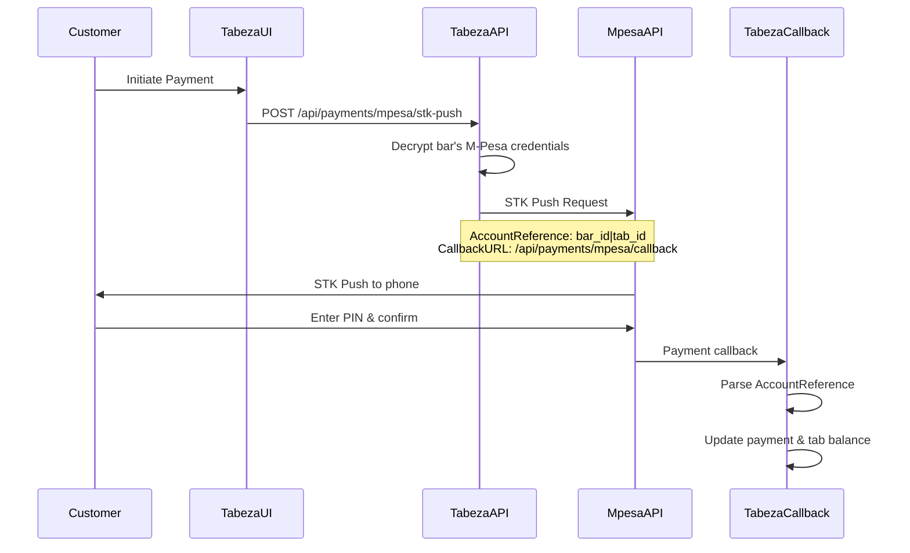

# M-Pesa Integration Architecture - Tabeza

## Overview
Tabeza's M-Pesa integration uses a **multi-tenant architecture** where each bar manages their own M-Pesa credentials while using a **centralized callback system**.

## Architecture Components

### 1. Central Callback URL ✅
**Single callback URL for all bars:**
```
https://api.tabeza.co.ke/api/payments/mpesa/callback
```

**Why this approach:**
- ✅ Single integration point with M-Pesa
- ✅ Easier to manage and monitor
- ✅ Scalable for unlimited bars
- ✅ No need to register multiple URLs with M-Pesa

### 2. Tenant Identification System
**Account Reference Format:**
```
{bar_id}|{tab_id}
```

**Example:**
```
438c80c1-fe11-4ac5-8a48-2fc45104ba31|tab_12345
```

**How it works:**
1. When initiating STK Push, we set `AccountReference` to `bar_id|tab_id`
2. M-Pesa includes this in the callback
3. Our callback handler parses it to identify which bar/tab the payment belongs to
4. Payment is processed for the correct tenant

### 3. Multi-Tenant Credential Management

**Each bar stores their own encrypted credentials:**
- `mpesa_consumer_key_encrypted`
- `mpesa_consumer_secret_encrypted` 
- `mpesa_passkey_encrypted`
- `mpesa_business_shortcode`
- `mpesa_environment` (sandbox/production)

**Security:**
- AES-256-CBC encryption
- Environment-based encryption key
- Credentials never stored in plain text

### 4. Payment Flow



## Database Schema

### bars table (M-Pesa columns)
```sql
-- M-Pesa configuration per bar
mpesa_enabled BOOLEAN DEFAULT false,
mpesa_environment VARCHAR(10) DEFAULT 'sandbox',
mpesa_business_shortcode VARCHAR(10),
mpesa_consumer_key_encrypted TEXT,
mpesa_consumer_secret_encrypted TEXT, 
mpesa_passkey_encrypted TEXT,
mpesa_setup_completed BOOLEAN DEFAULT false,
mpesa_test_status VARCHAR(20) DEFAULT 'pending',
mpesa_last_test_at TIMESTAMP
```

### mpesa_transactions table
```sql
-- Track M-Pesa specific transaction details
id UUID PRIMARY KEY,
payment_id UUID REFERENCES tab_payments(id),
bar_id UUID REFERENCES bars(id),
merchant_request_id VARCHAR(100),
checkout_request_id VARCHAR(100),
phone_number VARCHAR(15),
account_reference VARCHAR(200), -- bar_id|tab_id format
result_code INTEGER,
result_desc TEXT,
mpesa_receipt_number VARCHAR(50),
callback_received_at TIMESTAMP,
callback_data JSONB
```

## API Endpoints

### 1. Settings Management
- `GET /api/mpesa-settings?barId={id}` - Get masked credentials
- `POST /api/mpesa-settings` - Save encrypted credentials

### 2. Payment Processing  
- `POST /api/payments/mpesa/stk-push` - Initiate payment
- `POST /api/payments/mpesa/callback` - Handle M-Pesa callbacks
- `POST /api/payments/mpesa/test` - Test credentials

## Security Features

### 1. Credential Encryption
```javascript
// AES-256-CBC encryption with random IV
function encryptCredential(plaintext) {
  const iv = crypto.randomBytes(16);
  const cipher = crypto.createCipheriv('aes-256-cbc', key, iv);
  let encrypted = cipher.update(plaintext, 'utf8', 'hex');
  encrypted += cipher.final('hex');
  return iv.toString('hex') + ':' + encrypted;
}
```

### 2. Multi-tenant Isolation
- Each bar can only access their own credentials
- Account reference ensures payments go to correct tab
- Bar ID validation on all endpoints

### 3. Error Handling
- Graceful callback handling (always return success to M-Pesa)
- Comprehensive logging for debugging
- Fallback error states

## Benefits of This Architecture

### ✅ For Tabeza (Platform)
- Single callback URL to manage
- Centralized monitoring and logging
- Easy to scale to new bars
- Consistent payment processing

### ✅ For Bars (Tenants)  
- Use their own M-Pesa credentials
- Keep their own business shortcode
- Independent M-Pesa account management
- Direct relationship with M-Pesa

### ✅ For Customers
- Familiar M-Pesa experience
- Payments show bar's business name
- Standard M-Pesa receipts
- Reliable payment processing

## Current Status

### ✅ Completed
- Multi-tenant database schema
- Credential encryption system
- Central callback handler
- STK Push implementation
- Settings UI with masked credentials
- Test API for credential validation

### 🔧 Next Steps
1. Clean database state (run `fix-mpesa-database-state.sql`)
2. Test with real M-Pesa credentials
3. Verify end-to-end payment flow
4. Deploy to production environment

## Testing

Use `test-mpesa-setup-complete.js` to test the complete flow:
1. Reset database state
2. Save encrypted credentials  
3. Test M-Pesa API connection
4. Verify setup completion

This architecture provides the best of both worlds: **centralized management** for Tabeza with **independent M-Pesa accounts** for each bar.